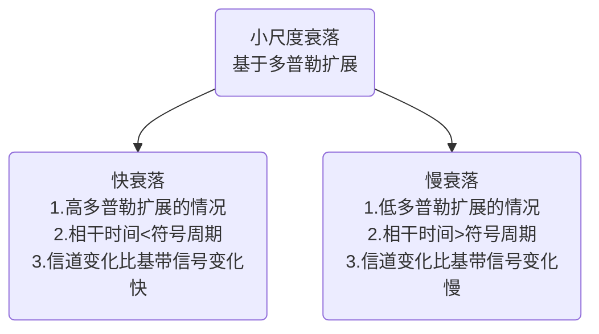
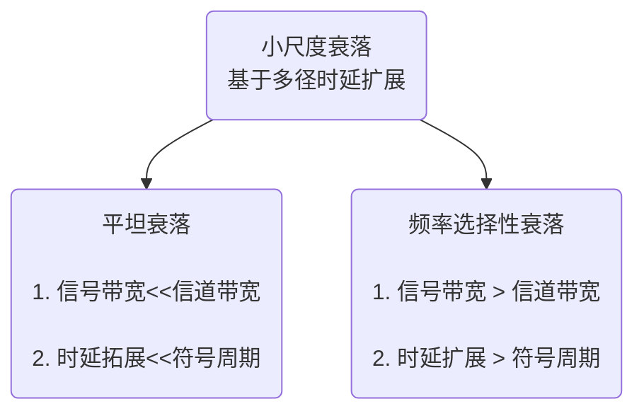

#! https://zhuanlan.zhihu.com/p/481464157

# 【现代通信原理】笔记

*Personal notes on modern communication principles*

现代通信原理的个人笔记，作为西电网信院《现代通信原理》课程的学习备考之用。

framist 2022年3月15日

- [【现代通信原理】笔记](#现代通信原理笔记)
- [【现代通信原理】1 导论](#现代通信原理1-导论)
  - [通信系统的基本结构](#通信系统的基本结构)
  - [消息的传输](#消息的传输)
  - [信道——消息的通路](#信道消息的通路)
    - [两个基本问题](#两个基本问题)
    - [其他问题](#其他问题)
  - [信道—— ==AWGN 信道==模型](#信道-awgn-信道模型)
  - [电磁波](#电磁波)
    - [电磁波频带](#电磁波频带)
    - [电磁波传播](#电磁波传播)
    - [电磁波管理](#电磁波管理)
  - [基带与频带传输](#基带与频带传输)
    - [模拟通信系统](#模拟通信系统)
    - [数字通信系统](#数字通信系统)
    - [数字通信系统的*有效性*指标](#数字通信系统的有效性指标)
      - [==码元传输速率== $R_B$ （传码率、波特率）](#码元传输速率-r_b-传码率波特率)
      - [==信息传输速率== $R_b$ （传信率，比特率）](#信息传输速率-r_b-传信率比特率)
      - [==频带利用率==——把 B 与 传输速率 联系起来](#频带利用率把-b-与-传输速率-联系起来)
    - [数字通信系统的*可靠性*指标](#数字通信系统的可靠性指标)
      - [==误码率== $P_e$](#误码率-p_e)
      - [==误信率== ( 误比特率） $P_b$](#误信率--误比特率-p_b)
  - [附录](#附录)
    - [练习题](#练习题)
- [【现代通信原理】2 无线信道的传播特征](#现代通信原理2-无线信道的传播特征)
  - [2.1 多径传播环境](#21-多径传播环境)
    - [无线通信信号的*四种传播方式*](#无线通信信号的四种传播方式)
    - [接收信号中的*四种效应*](#接收信号中的四种效应)
      - [阴影效应](#阴影效应)
      - [远近效应](#远近效应)
      - [多普勒效应](#多普勒效应)
      - [多径效应](#多径效应)
    - [三种**衰落**（Fading）](#三种衰落fading)
      - [大尺度路径损耗（ Large-Scale Path Loss ）](#大尺度路径损耗-large-scale-path-loss-)
      - [阴影损耗（中尺度损耗）（ Shadowing ）](#阴影损耗中尺度损耗-shadowing-)
      - [小尺度衰落（Small-Scale Fading 快衰落）](#小尺度衰落small-scale-fading-快衰落)
  - [2.2 大尺度路径损耗与阴影衰落](#22-大尺度路径损耗与阴影衰落)
    - [**dB**](#db)
    - [2.2.1 自由空间传播模型](#221-自由空间传播模型)
      - [本节公式与结论](#本节公式与结论)
      - [Friis 公式 定义](#friis-公式-定义)
      - [Friis 公式 适用范围](#friis-公式-适用范围)
      - [大气效应](#大气效应)
      - [视距（LOS）的极限传播距离](#视距los的极限传播距离)
      - [例题](#例题)
    - [2.2.2 光滑平面上的电波传播](#222-光滑平面上的电波传播)
      - [本节公式与结论](#本节公式与结论-1)
      - [双线模型](#双线模型)
  - [附录](#附录-1)
- [【现代通信原理】3 模拟调制系统](#现代通信原理3-模拟调制系统)
  - [调制的概念](#调制的概念)
    - [调制的目的](#调制的目的)
    - [调制的定义](#调制的定义)
    - [调制的分类](#调制的分类)
    - [调制模型](#调制模型)
  - [幅度调制](#幅度调制)
    - [常规调幅 (conventional AM)](#常规调幅-conventional-am)
    - [抑制载波双边带调幅（ DSB-SC ）](#抑制载波双边带调幅-dsb-sc-)
      - [发送与接收方法](#发送与接收方法)
      - [同步问题](#同步问题)
      - [评价](#评价)
    - [单边带（ SSB ）](#单边带-ssb-)
      - [LSB、USB信号公式](#lsbusb信号公式)
      - [接收方法](#接收方法)
      - [SSB的相移生成方法](#ssb的相移生成方法)
    - [残留边带（ VSB ）调幅](#残留边带-vsb-调幅)
  - [角度调制](#角度调制)
    - [FM 与 PM](#fm-与-pm)
    - [角度调制的基本参数](#角度调制的基本参数)
      - [调制的程度](#调制的程度)
      - [正弦消息特例与==调制指数==](#正弦消息特例与调制指数)
    - [角度调制的带宽与频谱特点](#角度调制的带宽与频谱特点)
      - [带宽 Carson 公式](#带宽-carson-公式)
      - [频谱特点](#频谱特点)
      - [评价](#评价-1)
  - [附录](#附录-2)
    - [作业](#作业)
    - [三角变换](#三角变换)
    - [示例](#示例)
  - [6.3 模拟脉冲调制](#63-模拟脉冲调制)
    - [PAM、PDM、PPM、](#pampdmppm)
    - [实际抽样𝟙 —— 自然抽样的 PAM](#实际抽样𝟙--自然抽样的-pam)
    - [实际抽样𝟚 —— 平顶抽样的 PAM](#实际抽样𝟚--平顶抽样的-pam)
- [【现代通信原理】4 数字基带传输](#现代通信原理4-数字基带传输)
  - [数字基带传输系统模型](#数字基带传输系统模型)
  - [数字基带传输信号](#数字基带传输信号)
    - [数字脉冲幅度调制 PAM](#数字脉冲幅度调制-pam)
      - [脉冲形式（码型）](#脉冲形式码型)
      - [一元 PAM](#一元-pam)
      - [多元 PAM](#多元-pam)
      - [速率与带宽](#速率与带宽)
    - [基带传输信号带宽计算](#基带传输信号带宽计算)
      - [数字基带信号的功率谱](#数字基带信号的功率谱)
      - [功率谱与第一过零点带宽](#功率谱与第一过零点带宽)
  - [噪声中的接收方法与性能](#噪声中的接收方法与性能)
    - [基本接收方法](#基本接收方法)
    - [最佳接受方法](#最佳接受方法)
    - [眼图](#眼图)
    - [二元信号的传输性能](#二元信号的传输性能)
      - [数字传输的可靠性指标](#数字传输的可靠性指标)
      - [二元传输的误码性能与曲线](#二元传输的误码性能与曲线)
    - [一般多元信号的接收](#一般多元信号的接收)
      - [接收方法](#接收方法-1)
      - [最小误码率](#最小误码率)
      - [误码率与误比特率](#误码率与误比特率)
      - [格雷编码](#格雷编码)
  - [常用码型](#常用码型)
    - [AMI 交替传号反转码](#ami-交替传号反转码)
    - [曼彻斯特码 / Biphase 数字双相码](#曼彻斯特码--biphase-数字双相码)
    - [Miller 密勒码 / 延迟调制码](#miller-密勒码--延迟调制码)
    - [CMI 传号反转码](#cmi-传号反转码)
    - [HDB3 3 阶高密度双极性码 （ AMI 码的改进）](#hdb3-3-阶高密度双极性码--ami-码的改进)
  - [带限信道上的传输方法](#带限信道上的传输方法)
    - [ISI 码间串扰](#isi-码间串扰)
    - [Nyquist 准则 与 无 ISI 条件](#nyquist-准则-与-无-isi-条件)
      - [Nyquist 准则](#nyquist-准则)
      - [时域条件](#时域条件)
      - [频域条件](#频域条件)
      - [带宽条件](#带宽条件)
    - [H(ω) 的设计](#hω-的设计)
      - [理想低通](#理想低通)
      - [升余弦滚降滤波器](#升余弦滚降滤波器)
    - [参考](#参考)
      - [作业](#作业-1)
- [【现代通信原理】5 数字带通传输](#现代通信原理5-数字带通传输)
  - [概述](#概述)
  - [二进制数字调制](#二进制数字调制)
    - [2ASK (OOK) 二进制振幅键控](#2ask-ook-二进制振幅键控)
      - [表达式](#表达式)
      - [调制](#调制)
      - [解调](#解调)
    - [2FSK 二进制频移键控](#2fsk-二进制频移键控)
      - [表达式](#表达式-1)
      - [调制](#调制-1)
      - [解调](#解调-1)
    - [2PSK 二进制相移键控](#2psk-二进制相移键控)
      - [表达式](#表达式-2)
      - [调制](#调制-2)
      - [解调](#解调-2)
    - [2DPSK 二进制差分相移键控](#2dpsk-二进制差分相移键控)
      - [调制](#调制-3)
      - [解调](#解调-3)
  - [多进制数字调制](#多进制数字调制)
    - [MASK 多进制振幅键控](#mask-多进制振幅键控)
      - [调制](#调制-4)
      - [解调](#解调-4)
    - [MFSK 多进制频移键控](#mfsk-多进制频移键控)
      - [调制解调](#调制解调)
    - [MPSK 多进制相移键控](#mpsk-多进制相移键控)
    - [QPSK（4PSK) 正交相移键控](#qpsk4psk-正交相移键控)
      - [调制](#调制-5)
      - [解调](#解调-5)
    - [OQPSK 偏置或交错 QPSK](#oqpsk-偏置或交错-qpsk)
    - [MDPSK 多进制差分相移键控](#mdpsk-多进制差分相移键控)
      - [调制解调](#调制解调-1)
    - [误码率分析](#误码率分析)
  - [信号空间与2D频带信号](#信号空间与2d频带信号)
    - [星座图的排布原则](#星座图的排布原则)
  - [传输系统结构与信号带宽](#传输系统结构与信号带宽)
  - [频带调制的特性与比较](#频带调制的特性与比较)
  - [OFDM](#ofdm)
  - [参考](#参考-1)
    - [作业](#作业-2)
- [【现代通信原理】6 信源编码](#现代通信原理6-信源编码)
  - [6.2 模拟信号的抽样](#62-模拟信号的抽样)
    - [6.2.1   低通模拟信号的抽样定理](#621---低通模拟信号的抽样定理)
      - [抽样](#抽样)
      - [重建](#重建)
    - [6.2.2   带通模拟信号的抽样定理](#622---带通模拟信号的抽样定理)
  - [6.3 模拟脉冲调制](#63-模拟脉冲调制-1)
    - [PAM、PDM、PPM、](#pampdmppm-1)
    - [实际抽样𝟙 —— 自然抽样的 PAM](#实际抽样𝟙--自然抽样的-pam-1)
    - [实际抽样𝟚 —— 平顶抽样的 PAM](#实际抽样𝟚--平顶抽样的-pam-1)
  - [6.4 模拟信号的量化](#64-模拟信号的量化)
    - [6.4.1  量化原理](#641--量化原理)
    - [6.4.2  均匀量化](#642--均匀量化)
    - [6.4.3  非均匀量化](#643--非均匀量化)
      - [压缩率 A 、 $\mu$](#压缩率-a--mu)
  - [6.5 PCM 脉冲编码调制](#65-pcm-脉冲编码调制)
    - [6.5.1 PCM的基本原理](#651-pcm的基本原理)
    - [6.5.2  常用二进制码](#652--常用二进制码)
  - [6.6 DPCM 差分脉冲编码调制](#66-dpcm-差分脉冲编码调制)
    - [差分脉冲编码调制 DPCM](#差分脉冲编码调制-dpcm)
    - [自适应差分脉码调制 ADPCM](#自适应差分脉码调制-adpcm)
  - [6.7 增量调制(ΔM & DM)](#67-增量调制δm--dm)
  - [参考](#参考-2)
    - [作业](#作业-3)
- [【现代通信原理】7 差错控制编码（信道编码）](#现代通信原理7-差错控制编码信道编码)
  - [概述](#概述-1)
    - [通信的可靠性](#通信的可靠性)
    - [差错控制方式](#差错控制方式)
    - [3 种自动请求重发(ARQ)系统](#3-种自动请求重发arq系统)
  - [第 1 讲 基本原理及简单编码](#第-1-讲-基本原理及简单编码)
    - [分组码基本原理](#分组码基本原理)
    - [1.1	奇偶校验（监督）码](#11奇偶校验监督码)
    - [1.2	二维奇偶校验（监督）码（方阵码）](#12二维奇偶校验监督码方阵码)
    - [1.3	恒比码(等重码)（仅了解）](#13恒比码等重码仅了解)
    - [1.4	正反码（仅了解）](#14正反码仅了解)
    - [校验和](#校验和)
  - [第 2 讲 线性分组码](#第-2-讲-线性分组码)
    - [汉明码](#汉明码)
    - [线性分组码一般原理](#线性分组码一般原理)
      - [H 校验矩阵](#h-校验矩阵)
      - [G 生成矩阵](#g-生成矩阵)
    - [校正子与错误图样](#校正子与错误图样)
    - [线性分组码的性质](#线性分组码的性质)
      - [① 封闭性](#-封闭性)
      - [② 最小距离](#-最小距离)
  - [第 3 讲 循环码](#第-3-讲-循环码)
    - [循环冗余校验(CRC)码](#循环冗余校验crc码)
      - [差错检验能力](#差错检验能力)
  - [参考](#参考-3)
    - [作业](#作业-4)
- [【现代通信原理】8 蜂窝系统](#现代通信原理8-蜂窝系统)
  - [8.1 概述](#81-概述)
    - [大区制](#大区制)
  - [8.2 蜂窝](#82-蜂窝)
    - [蜂窝的概念](#蜂窝的概念)
    - [切换（过区切换、越区切换）](#切换过区切换越区切换)
  - [8.3 区群](#83-区群)
    - [频率复用扩大系统容量](#频率复用扩大系统容量)
    - [确定最近的同信道相邻小区的规则](#确定最近的同信道相邻小区的规则)
    - [六边形小区的几何结构](#六边形小区的几何结构)
    - [频率复用比](#频率复用比)
  - [8.4 同信道与相邻信道干扰](#84-同信道与相邻信道干扰)
    - [8.4.1 同信道干扰](#841-同信道干扰)
    - [8.4.2 邻信道干扰](#842-邻信道干扰)
    - [8.4.3 蜂窝小区容量的改善](#843-蜂窝小区容量的改善)
      - [小区分裂](#小区分裂)
      - [扇区划分](#扇区划分)
      - [新微小区](#新微小区)
  - [参考](#参考-4)
    - [作业](#作业-5)
- [【现代通信原理】9 5G移动通信系统与技术](#现代通信原理9-5g移动通信系统与技术)

# 【现代通信原理】1 导论

## 通信系统的基本结构

发信者（==信源==）——发出需要传输的信息

接收者（==信宿==）——信息传输的终点

==信道==——连接两端间，某种能够传递电信号的物理媒质

==发送器==——把信息“制成”合适的电信号送入信道的装置

==接收器==——从信道接收电信号，“提取”出原信息的装置

## 消息的传输

双工系统、单工系统、半双工系统

==消息==或==信息==——是人们使用通信系统来传输的东西。

==信源==——产生消息或信息的单 元

消息的特性——必定是**随机的**、是接收方所未知的（随机性和价值）  
必要时，可以刻意进行区分：

* ==消息==——信源产生的**具体内容**，如一段语音、文字、数据和图  
  像等。
* ==信息==——消息内在的**真正新的、有意义的东西**，这种东西是基  
  本的，因而不能够再压缩。

## 信道——消息的通路

==信道==——连接发信者与收信者、**供传输信号经过**的通道；能够传输电、电磁波或光信号的某种物理媒质。

消息信号经**发送器**变换为相应的传输信号，进入媒质中传输

* 有线信道：（传输电的）普通导线、双绞线、同轴电缆、波
* 有线信道：（传输激光的）光导纤维；
* 无线信道：（传输电磁波的）空间（大气、真空）、水体。

### 两个基本问题

==信号衰减==——导线的电阻与长度成正比，使信号不断衰减；无线电波扩散本身减弱，且被阻挡物吸收；

==加性噪声==——“沿途”的电阻、固态器件等引入固有的**随机噪声**，最基本的是**热噪声**。

*包括发送器与接收器中的处理电路的噪声*

$$
r(t)=As(t)+n(t)
$$

考虑：放大后的接收信号与一并放大的噪声

变形

$$
A^{-1}r(t)=s(t)+A^{-1}n(t)
$$

$$
r(t)=s(t)+n(t)
$$

这样：巧妙地把**衰减与噪声**两个因素结合在一起

### 其他问题

外来==干扰==——无线通信是开放的，其他电磁波进入接收机就构成干扰；其他靠近的有线信号可通过电磁耦合 “**窜入**”信道

信号==畸变==——因信道特性不理想，信号通过后会**变形**。（如频带不理想、色散现象）

$$
r(t)=h(t)*n(t)
$$

频域：

$$
R(f)=H(f)S(f)+N(f)
$$

## 信道—— ==AWGN 信道==模型

信号衰减——使信号不断变弱

加性噪声——随机噪声，基本的是热噪声

$$
r(t)=s(t)+n(t)
$$

==白高斯噪声== (White Gassian Noise)

* ( 时域上 ) 随机性服从高斯分布
* ( 频域上 ) 噪声均匀分布在所有频率上

*功率谱密度值：每 Hz 内有多少噪声*

## 电磁波

### 电磁波频带

天线似“电波的跑道”一般不短于电波波长的 1/4  

电波传播特性主要由其频率值的大小决定。

### 电磁波传播

 空中传播时主要有三种模式：

* ==地波==（ Ground-Wave ）模式
* ==天波==（ Sky-wave ）模式
* ==空间波==（==视线== LOS, Line-of-sight ）模式

### 电磁波管理

频分复用 / 频分多址（ FDM/FDMA ）——  
多个传输信号通过错开频率位置共用频带的方法

频分技术的例子：

* ==频分复用==——有线通信中多个话音“错开频率”**共用一条电线**传输
* ==频分多址==——多个无线用户“使用各自的频率” 同时**接入通信系统**
* ==频分双工==——每个用户“采用不同频率” 接收与发送，**两个方向同时**传输。

## 基带与频带传输

基带信号——频谱位于零频率附近的信号  
基带传输——保持基带形式，直接传送消息信号

频带信号——频谱位于某高频率附近  
频带传输——把基带的消息信号转换为频带信号来传输

消息几乎都是基带信号  
无线信号都是频带信号

### 模拟通信系统

频带传输的核心任务

* ==调制==（ Modulation ）——将基带信号变换为适当的频带信号的  
  过程
* ==解调==（ Demodulation ）——调制的逆过程

调制的方法——用正弦波携带消息

正弦波 = 载波

$$
s(t)=R(t)cos(2 \pi f_c + \theta(t))
$$

使 $R(t)$ 与 $\theta(t)$（或两者同时）按一定的规律**跟随消息信号**变化，正弦波因这种变化而转变成频带信号，“携带”上消息。

* 幅度调制——用 $R(t)$ “携带”消息
* 角度调制——用  $\theta(t)$ “ 携带”消息

### 数字通信系统

* 格式化 ——“规范化”的数字符号序 列，必要时，包括模数变换
* ==基带调制==——形成合适的电信号，基带信号，通常是用脉冲生成。
* ==频带调制==——转换为频带信号
* 发射机 ——将信号送入信道
* ==同步== ——提供各种定时时钟
* ==信源编码==——实现压缩编码
* 加密——提供保密性
* ==信道编码==——故意加入特殊数据位（如，奇偶校验位等） 以便接收端发现与纠正错误
* 复 用 ——多种消息信号合并在一起
* 多址接入——多个用户进入共用系统
* 频谱扩展——展宽信号频谱可增加抗干扰与保密性，也可多址接入

**优点**

* 抗干扰能力强，且噪声不积累；
* 传输差错可控；
* 便于处理、变换、存储；
* 便于将来自不同信源的信号综合传输；
* 易于集成；易于加密。

**缺点**

* 可能需要较大的传输带宽；
* 对同步要求高。  ==（？也可自同步）==

### 数字通信系统的*有效性*指标

#### ==码元传输速率== $R_B$ （传码率、波特率）

定义：每秒传输的码元个数

单位：波特 Baud

若一个码元的时间长度为 $T_s$ 秒，则

$$
R_b= \frac{1}{T_s}
$$

#### ==信息传输速率== $R_b$ （传信率，比特率）

定义：每秒传输的比特数（信息量）。

单位：比特/秒（bit/s）简记为 b/s 或 bps

$R_b$ 与 $R_B$ 的关系：==H为信息熵==

$$
\begin{aligned}
&R_{b}=R_{B} \cdot H \\
&R_{b}=R_{B} \cdot \log _{2} M
\end{aligned}
$$

$M=2 \Rightarrow R_b=R_B$ 数值相等，单位不同

> 信息熵
>
> $$
> H\left( x \right) =-\sum_{i=1}^n{P\left( x_i \right) \log _2P\left( x_i \right)}=\log _2M
> \\
> \frac{1}{M}=P\left( x_i \right)
> $$
>

#### ==频带利用率==——把 B 与 传输速率 联系起来

定义为单位带宽内的传输速率，即

$$
\begin{aligned}
&\eta=\frac{R_{B}}{B} \quad(\mathrm{Baud} / \mathrm{Hz}) \\
&\eta_{b}=\frac{R_{b}}{B} \quad\left(\mathrm{~b} / \mathrm{s} \cdot \mathrm{Hz}^{-1}\right)\\
&\eta_{b}=\eta \cdot \log _{2} \mathrm{M}
\end{aligned}
$$

> Note:
>
> | 概念             | 传输速率                   | 备注                               |
> | ------------------ | ---------------------------- | ------------------------------------ |
> | 码元             | 波特率（波特Baud）         | 比如DNA码元 A G T C                |
> | 信息             | 比特率（b/s）              |                                    |
> | 信号元素（计网） | 波特率、脉冲速率、调制速率 | r=每个信号元素承载的数据元素的数量 |
> | 数据元素（计网） | 比特率                     |                                    |
>

### 数字通信系统的*可靠性*指标

#### ==误码率== $P_e$

$$
P_{e}=\frac{\text { 错误码元数 }}{\text { 传输总码元数 }}=\frac{N_{e}}{N}
$$

#### ==误信率== ( 误比特率） $P_b$

$$
P_{b}=\frac{\text { 错误比特数 }}{\text { 传输总比特数 }}=\frac{I_{e}}{I_{b}}
$$

二进制 $P_b=P_e$ ，M进制 $P_b<P_e$

## 附录

### 练习题

**一个信息序列，知道其符号是128元的，符号速率是8000波特，求该消息序列的比特速率。**

56kbps

# 【现代通信原理】2 无线信道的传播特征

**重点：**

* [X] 四种传播方式、四种效应、三种衰落
* [X] 自由空间模型：空间损耗公式适用范围、天线远场区、参考距离的计算；LOS近似公式
* [X] 双线模型、第一菲涅尔区、简化的双线模型（仅了解）

---

* 无线信道的**损伤性**

加性的，乘性的；  
时间上的，频率上的；  
干扰，周围环境噪声；  
快变化的，慢变化的等等

* 无线信道的**复杂性**

信道的特性随时间不同而发生变化

 

## 2.1 多径传播环境

### 无线通信信号的*四种传播方式*

**四种最基本传播方式**：

==直射==：发射机信号无阻挡到达接收机。

==反射==：当电磁波遇到比波长大得多的物体时发生反射，反射发生在地球表面、建筑物和墙壁表面。

==绕射==：当接收机和发射机之间的无线路径被尖锐的边缘阻挡时将发生绕射。

==散射==：当波穿行的介质中存在小于波长的物体并且单位体积内阻挡体的个数非常巨大时，将发生散射。散射发生于粗糙表面、小物体或其他不规则物体。

一般情况下，相对于直射波，反射波、绕射波、散射波都比较弱。

电波传播特性主要由其频率值的大小决定。

空中传播时主要有三种模式：

* ==地波==（ Ground-Wave ）模式——电波沿地表面弯曲传播方式

  * 2MHz 以下的电波主要按这种模式传播
  * 大致可以传输几十公里，在海洋上可以传播更远一些。
  * 主要用于越洋通信、海事广播等。
* ==天波==（ Sky-wave ）模式——电波经天空中电离层反射而折回地  
  面的传播方式。

  * 电离层（ Ionosphere ）——大气层受太阳紫外线与宇宙射线照射后产生的离子层，约地面 60~400km 高处。
  * 3-30MHz 的电波反射可以达到几百 ~ 1000km 远，多次反射可传更远
  * 主要用于长距离通信，军事的、政府的、企业的等，也有短波广播 电台。
  * 电离层周期性时变的，短波信道也是时变的。
* ==视线==（ LOS, Line-of-sight ）模式

  * 高于 30MHzMHz ，直到光波，都主要以这种方式传播
  * 向上传播时会穿透电离层而不被反射回来
  * 地面传播时，如遇到遮挡，信号会被阻断会显著衰减

==流星余迹通信==

* 通信距离远，单跳跨距可达 2000 公里
* 传输信道由流星进入大气层形成 ,无需申请转发器
* 应用地域不受限制，从极地到赤道都可使用
* 支持全时域、全天候工作
* 工作频率： 40MHz ～ 50MHz
* 业务种类：短消息、数据报文
* 最佳通信距离： 600~1300km
* 突发传输速率： 4kb/s ～ 64kb/s( 自适应可变 )
* 年平均数据通过量： 100 字符 /分钟

### 接收信号中的*四种效应*

#### 阴影效应

由于大型建筑物和其它物体的阻挡，在电波传播的接收区域中产生传播半盲区。

#### 远近效应

由于用户的随机移动性，发射机与接收机之间的距离也是在随机变化。若发射机发射信号功率一样，那么到达接收机时信号的强弱将不同，离接收机近者信号强，离接收机远者信号弱。

#### 多普勒效应

**多普勒频移（频率色散）**

由于用户处于高速移动（如车载通信）中，传播频率的扩散而引起的，其频率扩散程度（多普勒频移）与用户运动速度成正比。

$$
f_{d}=\frac{V}{\lambda} \cos \theta(t)=\frac{V f_{c}}{c} \cos \theta(t)
$$

*主要是$V/c$*

* **频率的扩展对应于时间的相干程度**

==信道的相干时间==

**信道的相干时间**与最大多普勒频移之间呈反比关系，这就是说，信道所造成的频率扩展程度越明显，该信道的相干时间就越短——对不同时间分量的选择性就越强。反之，相干时间会越长——不同时间分量将经历相似的衰落，信道对不同时间分量的影响是相似的。

信道的相干时间是一个时间区间的概念，这个时间区间越短就意味着信道响应随时间变化的越快。 比如，在一辆高速移动的汽车上进行接收信号测量，在同样的时间段上观察，相对于另一辆低速移动的汽车上进行同样的测量，前一种情形下接收信号将经历更多的变化。

* **基于多普勒频率扩展的小尺度衰落分类：**

#### 多径效应

它们到达时的信号强度、信号相位、信号频率、信号方向都是不一样的。

所接收到的信号是上述各路径信号的矢量和。称这种自干扰现象为多径干扰或多径效应。

**多径时延（时间色散）**

同一发射信号通过不同路径到达接收端，它到达的时间*先后*和*强度*会有不同。到达信号之间不同的时间差，称为存在多径时延。

多径时延对数字移动通信有极其重要的影响。

==信道的相干带宽==

**多径信道所造成的时间延迟程度越明显，该信道的相干带宽就越窄**——*对传输信号中不同频率分量的选择性就越强*。反之，相关带宽会越宽——不同频率分量将经历相似的衰落，信道对不同频率分量的影响是相似的。

另一方面，较大的多径时延会引起码间干扰，导致接收信号的时域波形失真，这时为克服**码间干扰的**影响，在接收端一般要设置均衡器。（就像音响里那种均衡器）

基于多径时延扩展的小尺度衰落分类

### 三种**衰落**（Fading）

接收信号电平随距离或时间波动，这种现象称为衰落

#### 大尺度路径损耗（ Large-Scale Path Loss ）

* 电磁波在空间传播，距离所产生的损耗
* 千米量级

#### 阴影损耗（中尺度损耗）（ Shadowing ）

* 由传播阻挡的阴影效应所产生的损耗
* 数百波长量级

#### 小尺度衰落（Small-Scale Fading 快衰落）

* 反映小范围接收电平平均值的起伏变化趋势
* 数十波长以下量级
* 衰落深度可达 20 － 40dB 。
* 电平幅度分布一般遵循：瑞利（ Rayleigh ）分布、莱斯（ Rice ）分布、纳卡伽米（ Nakagami ）分布等。
* 变化速率快。
* 具有**选择性**。即在不同频率、不同时间、不同空间，其衰落特性是不一样的。
* 是无线移动通信中**最难克服**的衰落。

*固定无线通信与移动无线通信相比，是否都存在小尺度衰落？* 常见于移动通信。

*慢衰落：相对于信号时间很长*

## 2.2 大尺度路径损耗与阴影衰落

无线信道是一个完全开放式信道，其传播损耗从宏观的大范围看，主要决定于*传播的环境*。

传播损耗不仅决定于*传播距离*，而且还与传播中的*地形、地貌、传播的载波频率、功率*，以及*发、收天线高度*等密切相关。

从理论角度给出一个确切、完整的公式很困难。一般在工程上多采用一些*模型与经验公式*，它对于工程技术人员而言已基本上能满足工程上的*估算*要求

### **dB**

* 几个常用**单位**：

dB = $10\log{x}$

dbW = $10\log{\frac{x}{1W}}$ 表示大于或小于 1 瓦的分贝数

dbmW (dBm) = $10 \log{\frac{x}{1mW}}$ 表示大于或小于 1 毫瓦的分贝数

*平方项，所以系数是10*

* 几个重要**概念**：

**3dB** 的概念

功率每增加一倍，其分贝值 (如 dBm) 增大 3dB ；反之，功率每减小一半，其分贝值减少反之，功率每减小一半，其分贝值减少3dB 。

**1dB** 的概念

功率每增加 25 ％，其分贝值增大约1dB(1.25 取对数）；反之，功率每减小一半，其分贝值减少反之，功率每减小 20 ％，其分贝值减少约 1dB (0.8 取对数）

30dbm~1W

37dbm~5W

40dbm~10W

47dbm~50W

50dbm~100W

* 实测数据：

GSM 基站 (BS) 接收机灵敏度典型值为：-104dBm ；

GSM 手持移动台 (MS) 接收机灵敏度典型值为：-102dBm 。

（ -100dBm 相当于 $10^{-10}$ mW ）

### 2.2.1 自由空间传播模型

自由空间传播模型：计算*完全无阻挡*的视距路径时接收信号的功率

==理想无线信道==：无阻挡、无吸收、无时变、无干扰，自由空间传播。

无线电波在自由空间传播时，其单位面积中的能量会因为扩散而减少。这种减少，称为自由空间的传播损耗。

#### 本节公式与结论

**自由空间中距发射机 d 处天线的接收功率为：**

$$
P_{r}=P_{t} G_{t} G_{r}\left(\frac{\lambda}{4 \pi d}\right)^{2}
$$

**自由空间路径损耗：**

$$
L_{p}(d)=20 \log \left(f_{c}\right)+20 \log (d)+32.44  ~ (\mathrm{dB})
$$

**d 处的接收功率与参考距离 d0 的接收功率的关系：**

$$
P_{r}(d)=P_{r}\left(d_{0}\right)\left(\frac{d_{0}}{d}\right)^{2} \quad d \geq d_{0} \geq d_{f}
$$

**两个天线之间直线传播最大距离是：**

$$
4.12\left(\sqrt{h_{t}}+\sqrt{h_{r}}\right)(\mathrm{km})
$$

#### Friis 公式 定义

$\lambda$ 信号波长；$d$ 距离 (m)

$P_t$ 发射功率；$P_r$ 接受功率

$G_t$ 发射天线增益；$G_r$ 接受天线增益

自由空间中距发射机 d 处天线的**接收功率**为：

$$
P_{r}=P_{t} G_{t} G_{r}\left(\frac{\lambda}{4 \pi d}\right)^{2}
$$

通常直接定义$\left(\frac{4 \pi d} {\lambda} \right)^{2}$ 为**自由空间路径损耗** $L_{p}(d)$

自由空间路径损耗 $L_{p}(d)$：$f_c$(MHz) $d$ (km)

$$
L_{p}(d)=20 \log \left(f_{c}\right)+20 \log (d)+32.44  ~ (\mathrm{dB})
$$

距离每增加一倍或发射频率每增加一倍，自由空间损耗就增加**6dB**

#### Friis 公式 适用范围

**仅适用于天线远场区**

==天线远场区==（Fraunhofer区）为超过远场距离 $d_f$ 的地区

远场距离 $d_f$ :

$$
d_{f}=\frac{2 D^{2}}{\lambda}
$$

$D$ 为天线的最大物理线性尺寸也称天线孔径

**参考距离**

$$
P_{r}(d)=P_{r}\left(d_{0}\right)\left(\frac{d_{0}}{d}\right)^{2} \quad d \geq d_{0} \geq d_{f}
$$

#### 大气效应

* 吸收衰减

  * 高频段
* 雨雾衰减

  * 在10GHz以下频段，雨雾衰减并不严重，一般只有几dB。
  * 在10GHz以上频段，雨雾衰减大大增加，达到几dB/km。
  * 下雨衰减是限制高频段微波传播距离的主要因素
* 大气折射

  * 影响通常等效为地球半径发生了变化
  * 对于超短波波段，折射现象尤为突出它会影响到视距的极限传播距离。

#### 视距（LOS）的极限传播距离

（修正之后的）

$R_e$：等效地球半径

$h_{t/r}$ ：天线高度

两个天线之间直线传播最大距离是：

$$
4.12\left(\sqrt{h_{t}}+\sqrt{h_{r}}\right)(\mathrm{km})
$$

#### 例题

### 2.2.2 光滑平面上的电波传播

反射的条件：当电波传播中遇到两种不同介质的光滑可反射平面（如地球的表面或水面）时，如果界面的尺寸远大于电波的波长时，产生反射。

反射的表现：反射角＝入射角

地面反射模型（双线模型、两径模型）

#### 本节公式与结论

**地面反射模型（双线模型）:**

*注意有的单位是千米有的是米*

**接收功率**

$$
P_{r}(d) \approx 4 P_{t} G_{t} G_{r}\left(\frac{\lambda}{4 \pi d}\right)^{2} \sin ^{2}\left(\frac{2 \pi h_{t} h_{r}}{\lambda d}\right)
$$

**双线模型路径损耗**

$$
L_{p}(d)=-10 \log \left[4\left(\frac{\lambda}{4 \pi d}\right)^{2} \sin ^{2}\left(\frac{2 \pi h_{t} h_{r}}{\lambda d}\right)\right](d B), d \gg h_{t} \pm h_{r}
$$

**第一费涅尔区距离**

$$
d_{c}=\frac{4 h_{t} h_{r}}{\lambda}
$$

**大于等于第一费涅尔区距离时，双线模型路径损耗简化为**

$$
\quad P_{r} \approx P_{t} G_{t} G_{r} \frac{h_{t}^{2} h_{r}^{2}}{d^{4}} \quad\left(d \gg h_{t} h_{r}\right)
$$

#### 双线模型

*略*

## 附录

多普勒推导

# 【现代通信原理】3 模拟调制系统

~30%

**重点**

* [X] 调制的目的与意义：适合信道、多路复用、拓展带宽、互换传输带宽与信噪比
* [X] 载波调制、脉冲调制（"6.3 模拟脉冲调制"[^1] PAM、PDM、PPM）
* [X] 幅度调制4种：设计上的递进关系。

  * [X] 着重常规调幅和 DSB。掌握原理框图每个点的原理波形、调制表达式、调幅指数、效率、解调同理、DSB 相干解调同步问题
* [X] 角度调制、同理、频谱特点、带宽

---

 

## 调制的概念

### 调制的目的

* 将调制信号转换成**适合于信道传输**的已调信号
* 通过把多个基带信号分别搬移到不同的载频处，实现信道的**多路复用**，提高信道利用率
* **扩展信号带宽**，提高系统抗干扰、抗衰落能力
* 实现**传输带宽**与**信噪比**之间的互换

### 调制的定义

调制就是把信号转换成适合在信道中传输形式的过程

* 广义调制分为**基带调制**和**载波调制**，载波调制是用调制信号（基带信号）控制载波的某个（或几个）参数的过程
* 狭义的调制就是指**载波调制**

### 调制的分类

根据*载波类型*、*调制信号*、*载波参数变化*的不同进行分类

* 连续波调制

  * 模拟连续波调制

    * 幅度调制

      * AM
      * DSB-SC
      * SSB
      * VSB
    * 角度调制

      * FM
      * PM
  * 数字连续波调制
* 脉冲调制

  * 模拟脉冲调制
  * 数字脉冲调制

### 调制模型

 

 

## 幅度调制

幅度调制——用消息去控制正弦载波的幅度变化

* 常规调幅（ Conv. AM ）*conventional*
* 抑制载波双边带调幅（ DSB-SC ）
* 单边带调幅（ SSB ）
* 残留边带调幅（ VSB ）

*线性调制*

### 常规调幅 (conventional AM)

$$
s_{A M}(t)=A_{c}[1+m(t)] \cos 2 \pi f_{c} t
$$

**频谱特点**

1. 频带信号: 位于载频 $f_{c}$,
2. 带宽 $B_{T}=2 B$
3. 上、下两个边带:  
    上边带 (USB) 一高于 $f_{c}$ 的边带  
    下边带 (LSB) 一低于 $f_{c}$ 的边带
4. $\pm f_{c}$ 处有两个冲激, 有纯载波。

**波形特点**

消息突显在载波包络上

**调幅指数**

$\beta_{AM}= \mathrm{max} {\left|m(t)\right| }$  

正常、临界、过调制

**波形特点**

消息突显在载波包络上

**调幅指数**

$\beta_{AM}= \mathrm{max} {\left|m(t)\right| }$  

-

 

**发送与接收**

产生：加、乘

接收：包络检波

**功率与效率**

==峰值平均功率比==（PAPR—Peak to Average Power Ratio）

$$
\mathrm{PRAP}_{m(t)} = \frac{\mathrm{max}   {\left| m(t) \right|}^2}{\overline{m^2(t)}}
$$

==调制效率==

$$
\eta_{A M}=\frac{P_{m}}{P_{A M}}=\frac{P_{m}}{P_{m}+P_{c}}=\frac{\overline{m^{2}(t)}}{1+\overline{m^{2}(t)}}
$$

$$
\eta_{A M_{-} \text {临界}}=\frac{1}{1+P A P R_{m(t)}}
$$

正弦测试信号PAPR=2，$\eta_{A M}$ = 33%

**评价**

接收简单，廉价实用

 

### 抑制载波双边带调幅（ DSB-SC ）

解决：$\pm f_c$ 处有两个冲击

**频谱特点**

1. 频带信号: 位于载频 $f_{c}$,
2. 带宽 $B_{T}=2 B$
3. 上、下两个边带:  
    上边带 (USB) 一高于 $f_{c}$ 的边带  
    下边带 (LSB) 一低于 $f_{c}$ 的边带
4. ~~$\pm f_{c}$ 处有两个冲激, 有纯载波。~~

**功率与调制效率**

$$
\begin{aligned}
P_{D S B} &=\overline{s_{D S B}^{2}(t)}=\overline{A_{c}^{2} m^{2}(t) \cos ^{2} 2 \pi f_{c} t} \\
&=P_{m}=A_{c}^{2} \overline{m^{2}(t)} / 2 \\
\eta_{D S B} &=1
\end{aligned}
$$

#### 发送与接收方法

产生：乘

接收：乘本振、低通

*需要同步的原因是要移到中间*

LPF：低通滤波器

#### 同步问题

相干解调——需要与载波同步的本地振荡

非相干解调——不需要与载波同步的本地振荡，如，包络检波

**锁相环（Phase-Lock-Loop）**

**VCO**： 用一个可控振荡器产生本振

**比较**：与含有载波信息的信号进行比较，看差距多大

**反馈**：用误差改进振荡

**滤波**：“长期观察”，不要草率调节

$$
\begin{aligned}
L P F_{\mathrm{B}} &\left\{A_{c} m(t) \cos 2 \pi f_{c} t \times \cos \left(2 \pi f_{o} t+\theta_{o}\right)\right\} \\
&=L P F_{\mathrm{B}}\left\{\frac{1}{2} A_{c} m(t)\left\{\begin{array}{l}
\cos \left[2 \pi\left(f_{0}-f_{c}\right) t+\Delta \theta\right] \\
+\cos \left[2 \pi\left(f_{0}+f_{c}\right) t+\Delta \theta\right]
\end{array}\right\}\right\} \\
&=\frac{1}{2} A_{c} m(t) \cos \left[2 \pi\left(f_{0}-f_{c}\right) t+\Delta \theta\right]
\end{aligned}
$$

#### 评价

效率高，噪声性能好

需要复杂的PLL

 

### 单边带（ SSB ）

*SSB（single side band）*

解决：对称的冗余

#### LSB、USB信号公式

$$
s_{S S B}(t)=\frac{1}{2} A_{c} m(t) \cos 2 \pi f_{c} t\mp \frac{1}{2} A_{c} \hat{m}(t) \sin 2 \pi f_{c} t
$$

$-$：上边带

$+$：下边带

$ \hat{m}(t)$：==希尔伯特变换==，简单来说就是幅度不变， 所有频率分量相移 $\pi/2$

> [希尔伯特变换（Hilbert变化） - 知乎 (zhihu.com)](https://zhuanlan.zhihu.com/p/422435352)
>
> 3、Hilbert变换的主要性质
>
> * Hilbert变换保持能量守恒
> * ![[公式]](https://www.zhihu.com/equation?tex=f%28t%29) 和 ![[公式]](https://www.zhihu.com/equation?tex=%5Ctilde%7Bf%7D%28t%29) 互为奇偶函数
> * ![[公式]](https://www.zhihu.com/equation?tex=f%28t%29) 和 ![[公式]](https://www.zhihu.com/equation?tex=%5Ctilde%7Bf%7D%28t%29)正交
>
> 4、常用的Hilbert变换对
>
> 
>

#### 接收方法

相干解调器

如加入足够的载波，也可用包络检波器

#### SSB的相移生成方法

**评价**

带宽 = B

### 残留边带（ VSB ）调幅

“残留”一点， 只要过渡带形状 满足对称互补

## 角度调制

瞬时相位，对应于载波的瞬时相位偏移，角频率，瞬时频偏 $\frac{d}{dt}(\phi(t))$

  

### FM 与 PM

频率和相位之间存在积分关系，可以相互转换

* 间接调相：调制信号->微分->调频->得调相波
* 间接调频：调制信号->积分->调相->得调频波

FM, 积分器->PM调制器

PM，微分器->FM调制器

PM可能间断，带宽宽；  
FM必定连续，带宽高效

同一个已调信号可以是FM与PM信号， 看起来令人困惑。  
FM与PM波形是相对的、关联的。

FM或PM是恒幅波  
不怕非线性失真！大功率放大器的常见问题。

### 角度调制的基本参数

#### 调制的程度

最大频偏/相偏

* 正比于调制系数 $k_{FM}$ 与 $k_{PM}$
* 正比于消息信号的（最大）幅度

#### 正弦消息特例与==调制指数==

时域表达式，调相指数表示最大频偏，调频指数表示最大相偏

### 角度调制的带宽与频谱特点

#### 带宽 Carson 公式

$D$ ：频偏比,正是调制指数 β

$$
D=\frac{\Delta f_{max}}{B} 
$$

$$
B_T = 2 \Delta f_{max} + 2B = 2(D+1)B
$$

卡森公式， 广泛用于计算调频信号带宽，可用于单一频率和非单一频率的调频，这里**调制指数**代表最大频偏与最高调制频率F的比值，其等于最大角频偏与最大角频率的比值。

普通单声道调频广播中，调制信号的最大频偏为75KHZ，最高调制频率F为15KHZ，故调频指数 =5，由公式可计算出此FM信号的频带宽度为180KHZ

#### 频谱特点

考虑正弦消息信号的FM情况:

$$
m(t)=a \cos \left(2 \pi f_{m} t\right) \\
s(t)=A_{c} \cos \left[2 \pi f_{c} t+\beta \sin \left(2 \pi f_{m} t\right)\right]
$$

1. $\beta<<1$ : **窄带角调制**; $\beta$ 变大时为**宽带角调制**;
2. $B_{T}$ 是以 Carson 公式估算, 准确地反映了信号的 带宽，对应部分包括约 99%的功率;
3. $m(t)$ 为正弦周期函数, 产生的调制信号是周期的。 频谱形状为基频的**大量谱线**构成, **细节变化大**。

在功率上调频信号平均功率等于未调载波平均功率，只是将原载波中部分功率分配给每个边频分量，分配原则与调频指数相关

#### 评价

高品质源于宽频带

* 宽带调频应用广泛
* 窄带调频应用较少

相对的，AM 广播采用一般语音消息，调制后 2x4=8（kHz）。 电台频带工作在1MHz上下（中波），只需10kHz。干扰易引起幅度变化，抗干扰能力差，音质不佳。  
高品质的 FM 广播工作在100MHz上下（超短波），频带需200kHz。横幅特性利于抗干扰，音质好，传播距离较近。

## 附录

### 作业

**既然模拟信号可以采用基带传输的方式进行传输，为什么还要引入频带传输？**

正确答案：

频谱资源的复用

不同频率信道的传输信道特性差异

扩展带宽，提高抗干扰能力

带宽和信噪比的互换

**已知调制信号$m(t)=cos(2000 \pi t)$，载波为$2cos10^4\pi t$，分别写出AM、DSB、USB、LSB信号的时域表示式，并画出频谱图。**

---

**已知某单频调频波的振幅是10V，瞬时频率为$f(t)=10^6+10^4cos2 \pi 10^3 t \mathrm{(Hz)}$，**

**（1）此调频波的表达式**

==TODO==

**（2）此调频波的最大频率偏移、调频指数和频带宽度**

### 三角变换

$$
\sin 2\alpha =2\sin \alpha \cos \alpha 
\\
\cos 2\alpha =\cos ^2\alpha -\sin ^2\alpha 
\\
=2\cos ^2\alpha -1
\\
=1-2\sin ^2\alpha 
\\
\tan 2\alpha =\frac{2\tan \alpha}{1-\tan ^2\alpha}
$$

$$
\sin ^2\frac{\alpha}{2}=\frac{1-\cos \alpha}{2}
\\
\cos ^2\frac{\alpha}{2}=\frac{1+\cos \alpha}{2}
\\
\tan \frac{\alpha}{2}=\frac{\sin \alpha}{1+\cos \alpha}
$$

$$
\sin \left( \alpha +\beta \right) =\sin \alpha \cos \beta +\cos \alpha \sin \beta 
\\
\sin \left( \alpha -\beta \right) =\sin \alpha \cos \beta -\cos \alpha \sin \beta 
\\
\cos \left( \alpha +\beta \right) =\cos \alpha \cos \beta -\sin \alpha \sin \beta 
\\
\cos \left( \alpha -\beta \right) =\cos \alpha \cos \beta +\sin \alpha \sin \beta 
\\
\tan \left( \alpha +\beta \right) =\frac{\tan \alpha +\tan \beta}{1-\tan \alpha \tan \beta}
\\
\tan \left( \alpha -\beta \right) =\frac{\tan \alpha -\tan \beta}{1+\tan \alpha \tan \beta}
$$

$$
\sin \alpha +\sin \beta =2\sin \frac{\alpha +\beta}{2}\cdot \cos \frac{\alpha -\beta}{2}
\\
\sin \alpha -\sin \beta =2\sin \frac{\alpha -\beta}{2}\cdot \cos \frac{\alpha +\beta}{2}
\\
\cos \alpha +\cos \beta =2\cos \frac{\alpha +\beta}{2}\cdot \cos \frac{\alpha -\beta}{2}
\\
\cos \alpha -\cos \beta =-2\sin \frac{\alpha +\beta}{2}\cdot \sin \frac{\alpha -\beta}{2}
\\
2\cos \alpha \cos \beta =\cos \left( \alpha -\beta \right) +\cos \left( \alpha +\beta \right) 
\\
2\sin \alpha \sin \beta =\cos \left( \alpha +\beta \right) -\cos \left( \alpha +\beta \right) 
\\
2\sin \alpha \cos \beta =\sin \left( \alpha -\beta \right) +\sin \left( \alpha +\beta \right)
$$

### 示例

**m(t) 波形和功率谱**

**AM 信号的波形和频谱**：

**DSB 信号的波形和频谱**：

**SSB**

**残留边带信号**

**角度调制**

## 6.3 模拟脉冲调制

### PAM、PDM、PPM、

### 实际抽样𝟙 —— 自然抽样的 PAM

**特点**：样值脉冲 $s(t)$ 的脉冲随原信号幅值 $m(t)$ 而改变

**抽样**与**恢复**原理框图：

**恢复**：均可用理想低通滤波器取出原信号。

 

### 实际抽样𝟚 —— 平顶抽样的 PAM

**特点**：每个样值脉冲的顶部是平坦的。

**产生**：抽样 + 保持

**恢复**：修正+低通滤波

   
   
 

 

# 【现代通信原理】4 数字基带传输

**重点**：

* [X] 什么是数字基带信号
* [X] 三个关键问题：差错、利用率、补偿
* [X] 脉冲码型：单极性多级性 NRZ、单极性多级性 RZ、差分、归零
* [X] 一元多元 PAM，

  * [X] 表达式、原理、框图，
  * [X] 速率，传输带宽（近似：第一个过零点），性能对比
* [X] （核心重点）理想低通系统的传输特性，以及在理想低通下基带传输的带宽与频带利用率
* [X] （核心重点）码间串扰（基带、带通）、为什么有；

  * [X] 无码间串扰的时域频域条件、理想低通特性、奈奎斯特带宽（最窄）、奈奎斯特速率（最快）；方法（切割、平移、叠加、对折）
* [X] 升余弦滚降滤波器，滚降因子，求最大传输码率

 

## 数字基带传输系统模型

① 什么是数字基带信号？

* 未经调制的数字信号，所占据频谱从零频或很低频率开始。

② 如何传输数字基带信号？

* 数字**基带**传输：数字基带信号不经载波调制而直接在信道上传输。
* 数字**频带**传输：数字基带信号经载波调制后在信道上传输。

③ 为什么要研究数字基带传输？

* **近程**数据通信系统中广泛采用，并有迅速发展的趋势。
* 基带传输中包含了频带传输的许多**基本**问题。
* 任何一个线性调制的频带传输系统可**等效**为基带传输系统来研究

> * 线性调制
>
>   * AM
>   * DSB
>   * SSB
>   * VSB
> * 非线性调制
>
>   * FM
>   * PM
>

**数字基带传输系统模型**

$$
H(f) = G_T(f) \cdot C(f) \cdot G_R(f)
$$

**关键问题**

① 如何设计总传输特性 $H(f)$，使得接收端恢复出的序列{an’}与发送端序列 ${a_n}$ 之间的**差错**尽可能少？

② 如何设计总传输特性 $H(f)$ ，使得在物理上可实现时，频带**利用率**尽可能高？

③ 当总传输特性 $H(f)$ 达不到设计要求时，可以采取什么办法进行**补偿**？

 

 

 

## 数字基带传输信号

### 数字脉冲幅度调制 PAM

*PAM，Pulse Amplitude Modulation*

* 二进制(Binary)序列：记为 0/1（或 +1/-1）
* PAM 采用不同幅度的脉冲构建传输信号
* 时隙(Slot)：一个时隙一个符号的传输
* 定时(Timing)：接收时对准相应脉冲，检测幅度。

#### 脉冲形式（码型）

==单极性(Unipolar) 与 双极性(Polar)==

* 单极性 NRZ 有直流分量，连续 0 时无法提取定时分量
* 双极性 NRZ 每个码之间都有 0 电平间隔，0，1 等概出现时无直流分量，恢复时判决电平 0

==不归零(NRZ) 与 归零(RZ)==

* 单极性 RZ，可直接提取定时分量
* 双极性 RZ，双极性 NRZ 的特点 + 定时分量提取，容易识别码元起止时刻
* 从占空比看，RZ 码占空比 50%，NRZ 100%

==传号(Mark) 与 空号(Space)==

* 传号差分码:“1 变 0 不变”
* 空号差分码:“0 变 1 不变”

==差分码/相对码 与 电平码==

* 差分码，相对码，用差分波形传送代码可以消除设备初始状态的影响，特别是在相位调制系统中用于解决载波相位模糊问题

#### 一元 PAM

表达式

$$
s(t)=\left[\sum_{n=-\infty}^{+\infty} b_{n} \delta\left(t-n T_{s}\right)\right] * g_{T}(t)=\sum_{n=-\infty}^{+\infty} a_{n} g_{T}\left(t-n T_{s}\right)
$$

#### 多元 PAM

表达式

$$
s(t)=\left[\sum_{n=-\infty}^{+\infty} a_{n} \delta\left(t-n T_{s}\right)\right] * g_{T}(t)=\sum_{n=-\infty}^{+\infty} a_{n} g_{T}\left(t-n T_{s}\right)
$$

2PAM 脉冲宽度更窄， 要求定时更准

MPAM 幅度层次多，要求分辨细致，易出错

#### 速率与带宽

> **回顾第一章的有效性度量：**
>
> 数字符号的速率、传输信号的带宽
>
> **回顾计网：**
>
> Nyquist 比特率（理论上最大比特率）（根据无码间串扰条件）
>
> $$
> \mathrm{比特率} = 2 \times \mathrm{带宽} \times \log_2{L}
> $$
>
> L：表示数据信号电平的数量
>
> 香农容量定理
>
> $$
> \mathrm{通道容量} = \mathrm{带宽} \times \log_2{(1+\mathrm{SNR})}
> $$
>
>> 信噪比的计量单位是 dB，其计算方法是 10lg(Ps/Pn)，其中 Ps 和 Pn 分别代表信号和噪声的有效功率，也可以换算成电压幅值的比率关系：20Lg(Vs/Vn)，Vs 和 Vn 分别代表信号和噪声电压的“有效值”
>>
>

PAM 传输信号是基带信号。PAM 信号的带宽由脉冲形状决定。

NRZ 矩形 PAM 信号带宽 = 无限

主要部分：$B_T = R_S = \frac{1}{T_s} (\mathrm{Hz})$ （第一零点）

$$
B_{T}= \begin{cases}R_{s} & \text { 矩形 NRZ脉冲 (最简单) } \\ 0.5 R_{s} & \text { 理论最小值 (最 “乐观”) }\end{cases}
$$

无论是二元或多元，BW 与 $R_s$ 直接关联 因为，“基层”传输是按 $T_s$ 进行的。

### 基带传输信号带宽计算

确定

* 带宽
* 直流分量
* 定时时刻

#### 数字基带信号的功率谱

> 本章通过功率谱描述频谱特性可以证明 $m(t)$ 是平稳随机过程。因此可以先推导 $m(t)$ 的自相关函数，再求自相关函数的傅氏变换，得到数字基带信号 $m(t)$ 的功率谱密度。
>

> 在通信系统中，信息符号等概率出现且符号之间互不相关。为了使频谱分析的物理概念清楚，推导过程简化，我们可以把 s(t)分解成稳态波 v(t)和交变波 u(t)。所谓稳态波，即是随机序列 s(t)的统计平均分量，它取决于每个码元内出现 g1(t)、 g2(t)的概率加权平均，且每个码元统计平均波形相同在此条件下，可以推导出 *m*(*t*)的功率谱密度。交变波的的功率谱 Pu(f)是连续谱，它与 g1(t)和 g2(t)的频谱以及出现概率 P 有关。根据连续谱可以确定随机序列的带宽。
>
> 稳态波的功率谱 Pv(f)是冲击强度取决 |Ck|2 的离散线谱，根据离散谱可以确定随机序列是否包含直流分量（k=0）和定时分量(k=1)。C_k----傅里叶变换系数，
>

可以分为两部分（忽略推导）

#### 功率谱与第一过零点带宽

单极性有冲击，归零比不归零第一过零点带宽大一倍

**功率谱密度曲线**

$$
R_z = \frac{1}{T_S}
$$

双极性无冲击

 

 

## 噪声中的接收方法与性能

1. 滤除噪声（**匹配滤波**最佳）
2. 测量波形得到 **r 值**
3. 通过**门限判决**（门限居“**正中**”）
4. 多元符号用**格雷编码**

**最佳基带传输**：双极性信号 + 匹配滤波器接收

* 双极性比单极性好 3dB；
* 匹配滤波器比 LPF 至少好 3dB

 

### 基本接收方法

 

### 最佳接受方法

1. 匹配滤波器与脉冲 $g_{T}(t)$ “相匹配”, 在时隙末端 $t_{0}=n T_{s}$ 处抽样输出 $r_{n}$,
2. 判决门限两种输出峰值的中心。

> ==匹配滤波器==是输出端的信号瞬时功率与噪声平均功率的比值最大的线性滤波器也就是说有最大的信噪比。其滤波器的传递函数形式是信号频谱的共轭。
>
> 一、滤波器的相频特性与信号相频特性共轭，使得输出信号所有频率分量都在输出端同相叠加而形成峰值。
>
> 二、按照信号的幅频特性对输入波形进行加权，以便最有效地接收信号能量而抑制干扰的输出功率。
>
> 即当信号与噪声同时进入滤波器时，它使信号成分在某一瞬间出现尖峰值，而噪声成分受到抑制。
>

比较：

 

### 眼图

==ISI== ：码间串扰

* 如何消除 $\mathrm{ISI}$   ？
* 如何抑制  $n(t)$ ？

**眼图**

* 可以从中观察到 $\mathrm{ISI}$ 、 $n(t)$ 的强弱
* 指示接受滤波器的调整，以减小 $\mathrm{ISI}$

**观察方法**

(a) 无 ISI 的情况——大“眼睛”(c) ，线迹细而清晰；

(b) 有 ISI 的情况——小“眼睛”(d)，且线迹杂乱。

存在噪声时，眼图线迹变成了模糊的带状线；噪声越大，线条越宽、越模糊，“眼睛”张开的越小，甚至闭合。

二进制双极性一个周期只有一只眼睛，M 进制双极性纵向显示的 M-1 个，三电平 AMI、HDB3 扫描周期为 nTB 时可以看到并排的 n 只眼睛

 

### 二元信号的传输性能

#### 数字传输的可靠性指标

1. ==误码 (符号) 率:== $P_{e} \approx \frac{\text { 错误符号数目 }}{\text { 总传输的符号数目 }}$
2. ==误比特率==: $\quad P_{b} \approx \frac{\text { 错误bit数目 }}{\text { 总传输的bit 数目 }}$

错误的根本原因是误码, 可折合为 bit 错。

* 对于二元系统, $P_{b}=P_{e}$;
* $P_{e}$ 与 $P_{b}$ 相关联, $P_{b} \leq P_{e}, P_{b_{-} \min }=\frac{P_{e}}{K}$ 。

> 降低误比特率：格雷码
>

#### 二元传输的误码性能与曲线

*感性了解即可*

背景知识：Q 函数

> 标准正态分布的右尾函数，又叫（标准正态分布的）互补累计分布函数
>

$E_b/N_0$：评价比特能量/噪声功率谱密度，反应信号噪声能量之比

**误比特率曲线比较：**

* 纵向比较：如 10dB 处，下边的性能较好
* 横向比较：如 $10^5$ 处，左边的性能好 3dB（12.5dB 减 9.5dB）。

**最佳基带传输**：双极性信号 + 匹配滤波器接收

* 双极性比单极性好 3dB
* 匹配滤波器比 LPF 至少好 3dB

 

### 一般多元信号的接收

#### 接收方法

#### 最小误码率

略

#### 误码率与误比特率

最小误码率：$Q\left(\sqrt{k \frac{E_{s}}{N_{0}}}\right)$

#### 格雷编码

> 背景资料
>

依据——传输中符号出错时几乎总是错 成相邻的符号值（因为幅度邻近）

技巧——相邻的符号值只差 1bit

 

 

 

## 常用码型

==线路码型== Line code —— 适合于线路传输的“波形格式”

**设计原则**

* 直流分量：可否在交流耦合电路中传输；
* 定时信息：是否包含足够的定时信息；
* 差分编码：不必担心传输中的反相；
* 传输带宽：通常要尽量小；
* 抗噪性能：不同的波形，抗噪能力不同；
* 检错能力：具有规律性的特征，可检错；
* 尽量简单。

### AMI 交替传号反转码

AMI, Alternative Mark Inversion

规则：1——交替的(+1)或(-1)；0——零电平(0）

缺点：长连“0”串时，无法提取时钟。

应用：AMI 码 3 电平信号，是北美电话系统中的接口标准之一。

### 曼彻斯特码 / Biphase 数字双相码

规则： 1-“下跳脉冲”；0-“上跳脉冲

优点：数字双相码没有直流分量，包含丰富的定时信息。

缺点：占用的带宽加大。

应用：用于 10Mbps 的以太网中。

### Miller 密勒码 / 延迟调制码

密勒（Miller）码/延迟调制码

规则： 1-“下跳”或“上跳脉冲”；0-负或正电平，连 0 时要交替。

优点：密勒码是数字双相码经过一级触发器后的结果，克服了数字双相码的定时相位不确定性。

### CMI 传号反转码

传号反转码(CMI)

规则：1-交替的正或负电平；0-上跳脉冲

特点：没有直流分量，跳变丰富，容易接收、易于检错。

应用：ITU-T 建议的一种接口标准。

### HDB3 3 阶高密度双极性码 （ AMI 码的改进）

规则：

1. 先进行 AMI 编码（B 为 +1 或-1）。
2. 检查连 0，将 0000 替换为  000V 或 B00V（V 为破坏元，+1或-1 ）使 B 正负交替、 V 正负交替；V 与前面 B 同极性。

特点：HDB3 具有 AMI 码的优点，译码简单，且容易提取定时时钟。

应用：ITU-T 推荐使用的码型之一。

 

 

## 带限信道上的传输方法

 

### ISI 码间串扰

$$
\begin{aligned}
r_{n} &=y\left(n T_{s}\right) \\
&=\sum_{k=-\infty}^{\infty} a_{k} h\left(n T_{s}-k T_{s}\right)+y_{n}\left(n T_{s}\right)\\
&=a_{n} h(0)+\sum_{k=-\infty \atop k \neq n}^{\infty} a_{k} h\left(n T_{s}-k T_{s}\right)+y_{n}\left(n T_{s}\right)\\
&=原始信号+码间串扰+加性噪声
\end{aligned}
$$

**码间串扰** (**I**nter-Symbol **I**nterference) —— 符号彼此间的干扰

原因：系统传递函数的不良（包括信道、 接收脉冲与发送滤波器等）。

**消除码间串扰的设计思想**

 

### Nyquist 准则 与 无 ISI 条件

#### Nyquist 准则

> 分两个问题，先不讨论噪声。考虑 h(t)，an 相互抵消不现实，如果前一码元到达后一码元判决时刻衰减为 0 就能实现，实际上有拖尾，很难实现，因此只要在 T+t0，2T+t0…抽样时刻为 0 即可
>

$$
\sum_{k=-\infty}^{+\infty} H\left(f-k R_{s}\right)=\text { 常数 }
$$

#### 时域条件

$$
h\left(k T_{B}\right)=\left\{\begin{array}{cc}
1, & k=0 \\
0, & k \text { 为其他整数 }
\end{array}\right.
$$

#### 频域条件

$$
\sum_i H (\omega + \frac{2\pi i}{T_B})=T_B, \quad \omega \leq \frac{pi}{T_B}
$$

#### 带宽条件

以 $R_B=1/T_B$ 的速率传输时，无 ISI

该条件称为奈奎斯特第一准则，基带系统总特性凡能满足此要求均可消除 ISI。可写成三部分之和，$H(\omega-2\pi/Ts)+H(\omega)+H(\omega+2\pi/Ts)$，若能等效为理想低通滤波器

**含义**：“切割，平移/对折，叠加” => 理想 LPF

检验或设计 $H(w)$ 能否消除码间串扰的理论依据。

*但是物理无法实现*

**无 ISI 重要结论**

1. $R_{s}$ 波特的基带信号的最小带宽 $=R_{s} / 2 \mathrm{~Hz}$ 。
   因为, 传输它的 $\mathrm{BW}$ 最小需要 $R_{s} / 2 \mathrm{~Hz}$ (无 ISI 要求: $W \geq R_{s} / 2$ )
2. 基带传输系统的奈奎斯特速率（无 ISI 最高的速率）- $2 \mathrm{~W}$ 波特。
   因为, $W$ 宽的信道每秒最多传输 $2 W$ 符号（无 $|S|$ 要求: $R_{s} \leq 2 W$ ）

==频带利用率== 一一 单位带宽的传输速率,

$$
\eta=\frac{\text { 传输速率 }}{\text { 占用频带宽度 }}=\frac{R_{s}}{B_{T}}(\text { baud } / \mathrm{Hz})=\frac{R_{b}}{B_{T}}(\mathrm{bps} / \mathrm{Hz})
$$

 

 

### H(ω) 的设计

#### 理想低通

> 理想低通特性冲击响应为 Sa 函数，在正负 kTB 有零点，发送序列间隔为 TB 时可以利用这些零点，接收端在 kTB 抽样实现无 ISI
>

**==奈奎斯特带宽==（最窄带宽）= $f_N$**

$$
f_N = B =\frac{1}{2T_B}
$$

**==奈奎斯特速率==（无 ISI 的最高波特率）= $2f_N$**

$$
2f_N = R_B =\frac{1}{T_B}
$$

**无 ISI 基带系统的==最高频带利用率== = 2**

$$
\begin{aligned}
\eta = R_B/B &= 2 &(\mathrm{Baud}/\mathrm{Hz})\\
&= 2 \log_2{M} &(\mathrm{bps}/\mathrm{Hz})
\end{aligned}
$$

> $R_B$ 码元传输速率
>
> 若以高于 $1/T_B$ 波特的速率传输码元，将存在 ISI，最高频带利用率为 2Baud/Hz,冲激响应波形衰减震荡幅度较大，定时稍有偏差就出现严重码间串扰，仅具有理论上的指导意义
>

 

#### 升余弦滚降滤波器

理想低通特性**存在问题** :

* 特性陡峭 不易实现；
* 响应曲线尾部收敛慢，摆幅大，对定时要求严格。

**解决方法**

* 对 $H(\omega)$ 在 $f_N$ 处按“奇对称”条件进行“圆滑/滚降”

==频响函数== Raised-Cosine RC：

$$
H(\omega)=\left\{\begin{array}{cc}
T_{B}, & 0 \leq|\omega|<\frac{(1-\alpha) \pi}{T_{B}} \\
\frac{T_{B}}{2}\left[1+\sin \frac{T_{B}}{2 \alpha}\left(\frac{\pi}{T_{B}}-\omega\right)\right], & \frac{(1-\alpha) \pi}{T_{B}} \leq|\omega|<\frac{(1+\alpha) \pi}{T_{B}} \\
0, & |\omega| \geq \frac{(1+\alpha) \pi}{T_{B}} 
\end{array}\right.
$$

$$
h(t)=\frac{\sin \pi t / T_{B}}{\pi t / T_{B}} \cdot \frac{\cos \alpha \pi t / T_{B}}{1-4 \alpha^{2} t^{2} / T_{B}^{2}}
$$

==滚降因子==：$0 \leq \alpha \leq 1$

==绝对带宽==：$W_{RC} = (1+\alpha)R_s/2$

RC 满足奈奎斯特准则, 因此, 无 ISI。

$$
\eta=\frac{2}{1+\alpha}(\text { baud } / H z)=\frac{2 \log _{2} M}{1+\alpha}(b p s / H z)
$$

频谱宽度与边沿特性都容易控制, 又能较好地近似实现。

例如, (单位: baud/Hz )

1. $\alpha=0.0: H_{R C}(f)$ 正是理想 LPF, $\eta=2$;
2. $\alpha=0.5: H_{R C}(f)$ 边沿相当平缓, $\eta=1.25$;
3. $\alpha=1.0, H_{R C}(f)$ 边沿非常平坦, $\eta=1$ 。

*让抽样时刻恰好为 0*

**例**

滚降系数 $\alpha \in (0,1)$

* $\alpha=0$

  * 优点 $\eta=2$ 最高
  * 缺点 不易实现，响应曲线收敛慢（鲁棒性性低）
* $\alpha=1$

  * 缺点 $\eta=1$ 最低
  * 优点 容易实现，响应曲线收敛快（鲁棒性性好）

> 综合解决：部分响应技术（略）
>

 

 

 

### 参考

#### 作业

**设随机脉冲序列的码元速率为 1200Baud，问：**

（1）采用单极性归零码时，求其第一零点带宽，并画出功率谱密度图。

（2）采用双极性不归零码，求其第一零点带宽，并画出功率谱密度图。

（1）

第一零点带宽=2400Hz

（2）

第一零点带宽=1200Hz

**某采用四进制信号传输的基带系统其总频率特性 |H(f)| 是滚降系数为 0.4、绝对带宽为 7kHz 的余弦滚降特性。**

（1）求无 ISI 传输时的最高比特信息速率和最高频带利用率（b/s/Hz）

（2）以 15kb/s 的比特速率传输时，有无 ISI？

# 【现代通信原理】5 数字带通传输

**重点**

* [X] 各种调制的原理框图、表达式、第一过零点带宽
* [X] 相干解调、包络解调
* [X] 调制误码的性能、带宽、曲线图（各种特性相互比较、排序）
* [X] 多进制带通调制的引入目的、代价、可靠性有效性、曲线图对比...FSK的特别性，其带宽的特殊性
* [X] 2ASK（OOK），PSK，FSK，DPSK：原理框图、表达式
* [X] CALL：了解（？）

 

   
   
 

## 概述

数字调制：可以看作是M进制符号集到M个载波构成的载波集的映射

实现数字调制的两种*基本方法*

* 利用**模拟调制**的方法去实现数字调制；
* 通过开关键控载波，通常称为**键控法** *shiftkeying*

  * 振幅键控(ASK)
  * 频移键控(FSK)
  * 相移键控(PSK)

   
   
 

## 二进制数字调制

### 2ASK (OOK) 二进制振幅键控

#### 表达式

$$
e_{\mathrm{2ASK}}(t)=s(t)cos{\omega_c}t
$$

#### 调制

#### 解调

**包络检波法**

**相干解调法**

噪声电压和信号共同对振幅产生影响，根据振幅识别比特会带来误码

 

### 2FSK 二进制频移键控

FSK 可视为两个不同载频的 2ASK 的叠加

#### 表达式

$$
e_{\mathrm{2FSK}}(t)=\left[\sum_{n}{a_ng(t-nT_s)}\right]\cos{(\omega_1t+\phi_n)+\left[\sum_{n}{{\overline{a}}_ng(t-nT_s)}\right]\cos{(}\omega_2t+\theta_n)}
$$

化简：

$$
e_{\mathrm{2FSK}}\left(t\right)=s_1\left(t\right)\cos{\omega_1}t+s_2\left(t\right)\cos{\omega_2}t
$$

#### 调制

**模拟调频法：** 相邻码元之间的相位是连续变化的。

**键控法：** 相邻码元之间的相位不一定连续。

**优点**：转换速度快、电路简单、产生的波形好、频率稳定度高。

#### 解调

**包络检波**

非相干解调，分上下两路分别解调，判决，不需要设定门限

**相干解调**

**其他解调方法**：鉴频法、差分检测法、过零检测法等。

 

### 2PSK 二进制相移键控

振幅和频率不变，表示信号的两种码元波形相同，极性相反，可以表示为一个双极性全占空矩形脉冲序列与一正弦波相乘。发0时 $a_n$ 取1，发1时 $a_n$ 取 $-1$

#### 表达式

#### 调制

模拟调制法、键控法

#### 解调

与 2ASK 相比，对 $s(t)$ 的要求不同，前者单极性，后者双极性基带信号。解调使用相干解调。

解调时假设相干载波与基准相位同相，2PSK载波恢复时存在180度相位模糊，涉及到同步问题，实际很少采用，长时间连续正弦波可能会使接收端无法确定码元起止时间。

 

### 2DPSK 二进制差分相移键控

*Differential PSK*

为了解决2PSK的问题，讨论差分相移键控，以未调载波相位为参考基准，绝对相移。由于倒$\pi$问题，解调可能出现反向工作，2DPSK，相对相移键控。对于A方式，解决了载波相位不确定问题，但对长码元仍存在码元定时问题。改用B方式，相邻码元间必有相位突跳。后者应用广泛。

利用前后相邻码元的载波相对相位表示信息。

#### 调制

先对二进制基带信号差分编码，由绝对码变换为相对码，再对相对码进行绝对调相，产生2DPSK。

**差分编码规则**：$b_n = a_n \oplus b_{n-1} $

#### 解调

相干解调 + 码反变换法 $a_n = b_n \oplus b_{n-1} $

*注意最开始要添加参考码元*

2DPSK 差分相干解调 (相位比较)法

 

 

 

## 多进制数字调制

$$
𝑅_𝑏=𝑅_𝐵 \log_2 M
$$

**目的**：提高信道的频带利用率

**代价**：误码率增大（判决范围减小），系统复杂

> 几种二进制调制的误码率，解调器输入端信噪比 r 是 e 的负指数
>

MASK、MFSK、MDPSK、MQSK

### MASK 多进制振幅键控

MASK可看成是二进制振幅键控（2ASK）的推广

MASK信号的功率谱 与 2ASK 信号具有相似的形式；

谱零点带宽是 M 进制数字基带信号带宽的两倍。

$$
B=2R_B=\frac{2R_b}{\log _2M}
$$

$$
B=\frac{2}{T_B}=\frac{2}{T_b\cdot \log _2\!\:M}
$$

在 $R_b$ 相同时，MASK 信号带宽是 2ASK 的 $1 / log_2 M$ 倍 。

MASK 的抗噪声能力差，常用多进制正交振幅调制（MQAM）来代替

#### 调制

与 2ASK 的产生方法相似，区别在于:

发送端输入的二进制数字基带信号需要先经过电平变换器转换为M电平的基带脉冲，然后再去调制。

#### 解调

与 2ASK 信号解调也相似，有相干和非相干解调两种。

 

### MFSK 多进制频移键控

MFSK 需要 M 个频率，要降低误码率就需要增大信号强度

要求载频之间的距离足够大，以便用滤波器分离不同频率的谱。

MFSK信号占用较宽的频带，信道频带利用率不高。

$$
B=\left| f_M-f_1 \right|+\frac{2}{T_B}
$$

MFSK一般用于调制速率 $(1/T_B)$ 不高的衰落信道传输场合。

#### 调制解调

 

### MPSK 多进制相移键控

利用载波的M种不同**相位**表示数字信息。

$M$ 增加后：

* 提高频带利用率
* 抗噪性能下降，设备复杂。（判决范围减小、噪声容限减小）

> 多进制PSK不能采用一个相干载波进行解调，存在相位模糊问题，$cos\theta_k=cos(2\pi-\theta_k)$
>
> 令振幅$A=1, s_k(t)=cos(\omega_0*t+\theta_k)=a_k*cos(\omega_0*t)+b_k*sin(\omega_0*t)$,可以看做是正弦和余弦两个正交分量合成。$a_k^2+b_k^2=1$。MPSK信号可以看做是两个MASK信号码元之和，带宽与MASK相同。
>

### QPSK（4PSK) 正交相移键控

quadrature Phase Shift Keying，**Q**PSK

M=4时，每个码元用两比特表示，对应四种相位之一

*对应关系可有不同规定，但相邻码组应符合格雷码编码规则*

*波形和相位不连续、波形连续相位不连续，相位不连续时，最大相位跳变180°，使限带的QPSK信号包络起伏很大，并出现包络零点，有时将码元周期包含整个载波周期的假设隐含不提，认为PSK信号初始相位相同，则码元边界瞬时相位一定连续*

**相位跳变**：0°, ± 90°, ± 180°

**跳变周期**：$2T_b$

**带宽**：$B=R_b$

**QPSK缺点**：

* 最大相位跳变180°，使**限带**的QPSK信号包络起伏很大，并出现包络零点 -> 出现旁瓣
* 频谱扩展大，旁瓣对邻道干扰大 -> 引起ISI

#### 调制

**正交调相法**

**相位选择法**

#### 解调

**原理**：分解为两路2PSK信号的相干解调。

*两路正交信号叠加，用两路相干载波去解调*

**存在问题**：存在900的相位模糊（0, 90, 180, 270）

**解决方案**：采用四相相对相位调制，即Q**D**PSK。

### OQPSK 偏置或交错 QPSK

Offset QPSK

> **QPSK缺点**：
>
> * 最大相位跳变180°，使**限带**的QPSK信号包络起伏很大，并出现包络零点 -> 出现旁瓣
> * 频谱扩展大，旁瓣对邻道干扰大 -> 引起ISI
>

**改进思路：**

信号点不作对角线移动即双比特ab不同时跳变

相位跳变 0或± 90°

在 **QPSK** 基础上，将两个正交分量的比特a、b**错开**半个码元（1bit时间），使a、b不可能同时改变

限带QPSK 与 限带OQPSK 对比：

  

### MDPSK 多进制差分相移键控

原理与 2DPSK 类似：利用相邻码元载波的相对相位变化 表示 数字信息。

4DPSK 也称 QDPSK

QDPSK 与 QPSK 的关系，如同2DPSK与2PSK关系

QDPSK的矢量图与QPSK的矢量图相似——只是参考相位是前一码元的载波相位

#### 调制解调

也有**正交调相法** 和 **相位选择法**

仅需在QPSK调制器基础上增添**差分编码（码变换）**

相干解调（极性比较）+码反变换

差分相干解调（相位比较法）

 

### 误码率分析

*细节略*

MASK -相干解调系统

MFSK –非相干解调

MFSK –相干解调

**MPSK 和 MDPSK**

 

 

## 信号空间与2D频带信号

### 星座图的排布原则

在2-D平面充分排布，应该注意：

* 加大彼此距离 —— 距离大 $P_e$ 小
* 控制平均能量 $E_s$ ——同等功率

实用规则：

* 分布均匀：使所有距离尽量大，最小相邻 $d_{min}$ 是总 $P_e$ 的“瓶颈”
* 收缩区域（能量对应信号的模长，对应于区域大小） 总体居中（同等结构，重心位于原点的，总能量最小）
* 尽量格雷编码。

$$
E_s=\frac{1}{M} \sum E_i = \frac{1}{M} {||s_i||}^2
$$

右边的排列更好

* 在多径衰落信道中，信号振幅和相位取值越多，受到的 影响越大，因而星型比方型更具有吸引力。
* 但方型星座的QAM信号的产生与接收更易实现。

## 传输系统结构与信号带宽

系统中存在两个完整的基带传输支路：

* 成形脉冲——构建RC谱特性，实现无ISI
* 匹配滤波——SRC配对，达到最大SNR解调，实现最佳传输 （基带信号的最佳接收）

*带通的带宽是基带的两倍*

## 频带调制的特性与比较

有效性——实现一定传输速率（符号率/比特率）需要的信号带宽  
可靠性——接收误码率、误比特率

QAM/PSK/ASK——带宽相同，不随M变化，而频带利用率随M上升

FSK——带宽由M子带构成，随M增加，频带利用率随M下降

## OFDM

正交频分复用（OrthogonalFDM）—— 把宽带信道分割为窄小的正交子带，把一条高速传输流变为并行的多条低速流

*具体略*

## 参考

### 作业

**某系统采用MPSK调制方式，在加性白高斯噪声信道上以50kb/s的速率传输数据。假设系统频域传输特性是滚降系数等于1的升余弦函数，系统带宽为50kHz。求：**

（1）MPSK调制中的M等于多少？

M等于2

（2）无 ISI 的最高频带利用率(b/(s*Hz))是多少？

1

**某2FSK调制系统的码元速率为2000Baud，已调信号的载频分别为6000Hz（对应“1”码）和4000Hz（对应“0”码）。求：**

（1）若发送的信息序列为1011001，试画出2FSK信号的时域波形。

（2）计算该2FSK信号的带宽

（2FSK谱零点是 $1/T_s$）

# 【现代通信原理】6 信源编码

**重点**

* [X] 模拟信号数字化 三个步骤

  * [X] 抽样
  * [X] 量化
  * [X] 编码

信源编码的作用

* 压缩编码
* 模数转换

模拟信号数字化传输的三个环节

1. A/D
2. 数字方式传输
3. D/A

A/D转换（数字化编码）的技术

* 波形编码
* 参量编码 *参量编码又称为声源编码，是将信源信号在频率域或其它正交变换域提取特征参量，并将其变换成数字代码进行传输。*

波形编码的**三个步骤**

* 抽样
* 量化
* 编码

脉冲调制

* 脉冲模拟调制

  * 脉幅调制 PAM
  * 脉宽调制 PDM
  * 脉位调制 PPM
* 脉冲数字调制

  * 脉码调制 PCM
  * 增量调制 DM

波形编码的常用方法

* PCM
* DPCM
* ∆M

   
   
 

## 6.2 模拟信号的抽样

抽样定理——模拟信号数字化和时分多路复用的理论基础

### 6.2.1   低通模拟信号的抽样定理

#### 抽样

最高频率小于 $f_H$ 的模拟信号 $m(t)$ 可由其等间隔的抽样值**唯一确定**，抽样间隔 $T_s$ 或 抽样速率 $f_s$ 应满足：

*也是奈奎斯特，原因？*

否则会发生混叠失真现象（频域）

#### 重建

   
 

### 6.2.2   带通模拟信号的抽样定理

==定理：带通模拟信号的最小抽样速率：==

$$
f_s=2B(1+\frac{k}{n})
$$

推导：

   
   
 

## 6.3 模拟脉冲调制

### PAM、PDM、PPM、

### 实际抽样𝟙 —— 自然抽样的 PAM

**特点**：样值脉冲 $s(t)$ 的脉冲随原信号幅值 $m(t)$ 而改变

**抽样**与**恢复**原理框图：

**恢复**：均可用理想低通滤波器取出原信号。

 

### 实际抽样𝟚 —— 平顶抽样的 PAM

**特点**：每个样值脉冲的顶部是平坦的。

**产生**：抽样 + 保持

**恢复**：修正+低通滤波

   
   
 

## 6.4 模拟信号的量化

量化 —— 幅度上离散化

量化后的信号 —— 多电平数字信号

 

### 6.4.1  量化原理

用 **有限个量化电平** 表示 **无限个抽样值**

*先略*

量化噪声功率：

信号 $m_k$ 的平均功率：

信号==量噪比==  S/Nq ——信号功率与量化噪声功率之比 ：

 

### 6.4.2  均匀量化

等间隔划分输入信号的取值域

**均匀量化的缺点**

* 信号小时，量噪比小，输入信号动态范围小
* 编码位数多

应用：主要用于概率密度为均匀分布的信号，如遥测遥控信号、图像信号数字化接口中。

解决方案：**非均匀量化**

 

### 6.4.3  非均匀量化

量化间隔不相等的量化方法

**压缩**再均匀量化

* 目的：提高小信号的量噪比
* 作用：压大补小
* 特性：$y=f(x)$ 对数特性

#### 压缩率 A 、 $\mu$

一致性不好->用折线法解决

13折线近似 A 律

15折线逼近 $\mu$ 律

   

## 6.5 PCM 脉冲编码调制

Pulse Code Modulation, **PCM**  模拟信号数字化方式之一

### 6.5.1 PCM的基本原理

三个步骤：抽样、量化、编码

  

### 6.5.2  常用二进制码

* 自然二进码
* 格雷二进码：一位不同
* 折叠二进码：首位表极性，后位表幅度

  * 极性码：表示样值的极性。正编“1”，负编“0”
  * 段落码：表示样值的幅度所处的段落
  * 段内码：16种可能状态对应代表各段内的16个量化级

码位数N的关系

* L 为 2 的整数次幂时

$$
N = log_2{L}
$$

* L 不为 2 的整数次幂时

$$
N = \lfloor {log_2{L}} \rfloor  + 1
$$

## 6.6 DPCM 差分脉冲编码调制

PCM的改进型，是一种预测编码方法

### 差分脉冲编码调制 DPCM

DPCM：对相邻样值的差值进行编码。

与PCM相比可减少量化器的量化级数，即编码位数减少，比特率降低，带宽减小

### 自适应差分脉码调制 ADPCM

ADPCM ，Adaptive DPCM

ADPCM是为了改善 DPCM 的性能，而将**自适应技术**引入到量化

和预测过程。其主要特点：

① **用自适应量化取代固定量化**： **自适应量化** 指量化台阶随信号的变化而变化 ，使量化误差减小。

② **用自适应预测取代固定预测**： **自适应预测** 指预测系数可随信号的统计特性而自适应调整 ，提高预测信号的精度 。

   通过这二点改进 ，**可大大提高输出信噪比**和 **编码动态范围**

   
   
 

## 6.7 增量调制(ΔM & DM)

—— 可看作一种最简单的 DPCM （量化电平数取 2 即对预测误差进行1位编码）

   
   
 

## 参考

### 作业

# 【现代通信原理】7 差错控制编码（信道编码）

**重点**

* [X] 检错、纠错
* [X] 检纠错能力两个公式。纠错能力 t、检错能力 e（重要）
* [X] 差错控制方式：前向纠错，检错重传，混合纠错
* [X] 分组码：校验矩阵、监督码元、效率、码长、（最小）码距、码重
* [X] 恒比码正反码（仅了解）
* [X] 线性分组码：线性码、汉明码、校正子的作用。清楚原理
* [X] H 矩阵，G 矩阵 构成，转换关系（重要）

部分内容结合计算机网络原理

* 第 10 章：检错与纠错（线性分组码、CRC）
* 第 11 章：数据链路控制（ARQ 系统）

 

## 概述

### 通信的可靠性

*可靠性增加，有效性减小*

*要将质量要求与误码率两者匹配起来*

**误码**

* 针对乘性干扰：采用均衡等措施
* 针对加性干扰：合理选择调制/解调方法、增大发射功率
* 对剩余的误码：采用**差错控制**、**交织**等措施，加以纠正

### 差错控制方式

应根据信道类型、对实时性和误码率的要求等因素来选择。

信道类型 — 根据错码的不同分布规律分为：

* 随机信道:错码是随机独立出现的
* 突发信道:错码是成串集中出现的
* 混合信道:既有随机错码又有突发错码

差错控制方式：

* 检错重发——自动请求重发(ARQ)
* 前向纠错（英语：forward error correction，缩写 FEC）*前向纠错是一种差错控制方式，即纠错编码*
* 混合纠错

技术措施：

* 纠错编码
* 纠错策略 —— 即以上差错控制方式

### 3 种自动请求重发(ARQ)系统

* 停止等待 ARQ 系统
* 拉后 ARQ 系统​

  * 回退 N 帧 ARQ
  * 选择重发 ARQ 系统
  * 选择性重复 ARQ

> 参考计网
>

**编码器** 对输入的信码进行分组编码（加入校验元）后发送。若收到接收端的重发(NAK)指令，执行重发。

**译码器** 对接收码校验，若发现有错，则通过反向信道发送一个 重发(NAK)指令，指示发送端重发。若无错，则发送确认(ACK) 指令，指示发送端正常发送。

ARQ 的主要优点：与前向纠错 (FEC) 方法相比

* 能抵抗大误码率，适应不同特性的信道；
* 检错的计算复杂度较低；

ARQ 的主要缺点：

* 重发使得 ARQ 系统的传输效率降低。
* 需**双向信道**来重发，不适用单向信道和一点到多点的通信系统

## 第 1 讲 基本原理及简单编码

==校验（监督）码元==：发送端在信息码元序列中增加一些差错控制码元，以便收端判断正误，它们被称为校验码元。校验码元位数不同，检错或纠错能力就不同。

==编码效率==（简称**码率**）：设编码序列中信息码元数量为 *k*，总码元数量为 $n(n>k)$ ，则比值 $R=k/n$ 就是码率。校验码元数 $r=n-k$。

差错控制编码表面上降低有效性，换取更低误码率，提高可靠性。但信息速率可能更接近信道容量

### 分组码基本原理

==分组码==：把一个长数据文件分成若干个长度相等的信息码组，在每个码组后加上校验码。与分组码并称的另一种码是==卷积码==。

==系统码==：信息位保持不变，在其后加上校验位的纠错码

==非系统码==：编码码组中无对应信息位（信息位和校验位交叉）

==许用码组==

==禁用码组==：接收端一旦收到禁用码组，就认为出现了错码。

==校验码元==：系统码的校验码元冗余

==码长== ($n$)：码组（码字）中的码元个数。

==码重== ($W$)：码组 $a$ 中“1”的数目，$w(a)$。

==码距== ($d$)： 两个码组 a、b 对应位上不同值的个数，称为码组  的距离 $d(a, b) = w(a+b)$。—又称汉明距离。（“+”按位模 2 加）

==最小码距== ($d_0$)：某种编码各个码组之间距离的最小值

最小码距 $d_0$ 和检纠错能力的关系（可以画图方便理解）

* 检 e 个错码 $d_0\geqslant e+1$
* 纠 t 个错码 $d_0\geqslant 2t+1$
* 纠 t 个错码 & 检 e 个错码 $d_0\geqslant e+t+1 (e>t)$

### 1.1	奇偶校验（监督）码

### 1.2	二维奇偶校验（监督）码（方阵码）

### 1.3	恒比码(等重码)（仅了解）

“1”的数目与“0”的数目之比保持恒定。

### 1.4	正反码（仅了解）

每个码组的校验位数等于信息位数，校验位值由信息码中的“1” 的数目确定：

* 当信息码中有奇数个“1”时，校验位是信息位的重复；
* 当信息码中有偶数个“1”时，校验位是信息位的反码；

该码能够严格地纠正任意 1 位错码，码率为 1/2。

### 校验和

> 计网内容
>

反码、求和、0

## 第 2 讲 线性分组码

* ==线性码==：按照一组线性方程构成的**代数码**。即每个码字的校验码元是信息码元的线性组合。
* ==代数码==：建立在代数学基础上的编码。
* ==分组码==：每一码组的校验码元仅与本组中的信息码元有关。
* ==线性分组码==：按照一组线性方程构成的分组码。例如，奇偶校验码就是一种 $(n, n-1)$ 线性分组码。

符号表示：一种码若码长是 n，其中信息码有 k 位，称为 $(n, k)$ 码，如 (7, 4) 码。以下以 (7, 4) 码为例。

信息码向量 $\vec{m} = (m_3,m_2,m_1,m_0)$

发送码向量 $\vec{A} = (a_6,a_5,a_4,a_3,a_2,a_1,a_0)$

接收码向量 $\vec{B} = (b_6,b_5,b_4,b_3,b_2,b_1,b_0)$

### 汉明码

校正子：s

校验关系式：

若 s=0，认为无错（偶校验时）；若 s=1，认为有错 。—— 检错

若要构造具有纠错能力的 (*n,* *k*) 码，则需增加校验元的数目。 *s* (即方程)的个数等于校验元位数 *r*。

对于 (*n*, *k*) 线性分组码，若希望用 *r*=*n*-*k* 个校验码元构造出 *r* 个校验

关系式来指出一位错码的 *n* 种可能的位置，则 *r* 必须满足：

$$
2^r-1\geq n \ 或\  2^r \geq k + r + 1
$$

*-1 是因为还有一种可能性没有错*

当“=”成立时，构造的线性分组码称为汉明码——能纠 1 位错码高效线性分组码

$$
(n,k) = (2^r-1,2^r-1-r)
$$

信息元和校验 (parity check)元是平等的

* 汉明码特点

**码参数**：

式 $2^{r}-1 \geq n$ 中的等号成文. 即 $(n, k)=\left(2^{r}-1,2^{r}-1-r\right) \quad$，$ r$ 是不小于 3 的任意正整数

**最小码距**:

$$
d_{0}=3 \text { (纠1或检2) }
$$

**编码效率**:

$$
R_{c}=\frac{k}{n}=\frac{n-r}{n}=1-\frac{r}{2^{r}-1}
$$

当 $n$ 很大时, $r$ 相对很小, 码率 $R_{\mathrm{c}}$ 接近 1 。

可见，汉明码是能够纠正 1 位错码的最高效线性分组码。

### 线性分组码一般原理

#### H 校验矩阵

若矩阵由一个小矩阵和满秩的单位阵组合而成，则称它为**典型矩阵**。

**H** 的各行是线性无关的。否则得不到 *r* 个线性无关的校验关系式。

 若一矩阵能写成典型阵形式 $[P\quad I_r]$，则其各行一定是线性无关的。

#### G 生成矩阵

将上面汉明码例子中的校验位计算公式： 改写成矩阵形式：

式中，$Q$ 为一个 $k\times r$ 阶矩阵，它是 $P$ 的转置，即

$$
Q=P^\text{T}
$$

可见，给定信息位后用信息位行向量乘矩阵 $Q$ 就产生校验位。

将 $Q$ 的左边加上一个 $k\times k$ 阶单位方阵，就构成矩阵:

具有 $[I_k \ Q]$ 形式的 $G$ 称为典型生成矩阵。由典型得 $G$ 到的码称为**系统码**

> 系统码：信息位保持不变，在其后加上校验位的纠错码
>

**G 矩阵的性质**

① **G** 矩阵是 $k\times n$ 矩阵。

② **G** 的各行是线性无关的；它的各行本身就是一个码组。

∴ 若有 *k* 个线性无关的码组，则可用其组成生成矩阵 **G**，生成其余码组。

可以看出：任一码组 **A** 都是 **G** 的各行的线性组合。**G** 共有 *k* 行，可以组合出 $2^k$ 种不同的码组 **A**。

**G 和 H 的关系**

非典型的 G 或 H 可以通过行线性变换变成典型的 G 、H ，仍然对应于该编码。可以由此进行 G 、H 互求。

### 校正子与错误图样

则发送码组和接收码组之差就是==错误图样==

设发送码组为一个 $n$ 元行向量 $A$, 接收码组行向量 $B$

$$
\boldsymbol{A}=\left[\begin{array}{lll}
a_{n-1} a_{n-2} & \cdots & a_{1} a_{0}
\end{array}\right] \quad \boldsymbol{B}=\left[b_{n-1} b_{n-2} \cdots b_{1} b_{0}\right]
$$

则发送码组和接收码组之差就是错误图样:

$$
\boldsymbol{B}-\boldsymbol{A}=\boldsymbol{E}=\left[\begin{array}{ll}
e_{n-1} e_{n-2} & \cdots e_{1} e_{0}
\end{array}\right]
$$

式中：

$$
e_{i}=\left\{\begin{array}{lll}
\mathbf{0}, & \text { 当 } b_{i}=a_{i} & \text { 表示该接收码元无错 } \\
\mathbf{1}, & \text { 当 } b_{i} \neq a_{i} & \text { 表示该接收码元有错 }
\end{array}\right.
$$

$S$ 称为==校正子==（伴随式）。

校正子 $S$ 与错误图样 *E* 一一对应，而与发送码 *A* 无关。

(n,k) 线性分组码译码的三个步骤：

1. 由接收码组 *B* 计算：$ S = H · B^T$
2. 由 $S$ 找到错误图样 *E*；
3. 由公式 $A = B – E$ 得到译码器译出的码组。

注：若 *B* 中错误超过纠错能力，则也可能 $S = H · B^T=0$。此种错误不可检。

### 线性分组码的性质

#### ① 封闭性

一种线性码中任意两个许用码组 $A_1$ 和 $A_2$ 之和 $(A_1+A_2)$ (按位模 2 加) 后的码组，仍为该码中的一个许用码组。

证明：若 $A_1$ 和 $A_2$ 是两个码组，则有 $H \cdot A_1^\text{T} = 0$ 和 $H\cdot A_2^\text{T} = 0$，

将两式相加，有 $H \cdot A_1^\text{T} + H\cdot A_2^\text{T} = H\cdot(A_1+A_2)^\text{T}= 0$（证毕）

#### ② 最小距离

码的最小距离就是码的最小重量

证明：根据码的封闭性，可知两个码组 $A_1$ 和 $A_2$ 之间的距离(即对应位不同的数目)必定是另一个码组 $A_1 + A_2$ 的重量(即“1”的数目)。

注：从生成矩阵 G 的最小行重量常常就能判断最小距离

## 第 3 讲 循环码

*具体内容略*

循环性：指任一码组循环移位（将最左端的一个码元移至右端， 或反之），仍为该码中的一个码组；

==循环码==：除了具有线性分组码的一般性质外，还具有循环性

### 循环冗余校验(CRC)码

> 计网重点
>

* 数据字：$d(x)$
* 码字：$c(x)$
* 生成多项式：$g(x)$
* 校正子：$s(x)$
* 差错：$e(x)$

$$
\frac{接受的码字}{g(x)} = \frac{c(x)}{g(x)} + \frac{e(x)}{g(x)}
$$

#### 差错检验能力

* 单个位差错

  * 如果 $g(x)$ 项数至少为 2 且 $x^0$ 的系数为 1，那么所有的单个位差错都能捕捉到。
* 两个独立的单个位差错

  * 如果生成多项式不能整除 $x^t+1\quad 0\leq t\leq n-1$，那么所有的独立双差错都能被检测到
* 奇数个差错

  * 包含因子 $x+1$ 的生成多项式能检测到所有奇数个差错
* 突发性差错 （$L$：差错长度； $r$：校验位数）

  * 所有 $L\leq r$ 的突发性差错都能被检测到
  * 所有 $L=r+1$ 的突发性差错有 $1-(1/2)^{r-1}$ 的概率会被检测到
  * 所有 $L>r+1$ 的突发性差错有 $1-(1/2)^{r}$ 的概率会被检测到

高性能生成多项式 $g(x)$ 需要有以下特性：

* 至少有 2 项
* $x^0$ 项的系数是 1
* 它不能整除 $x^t+1$，（t 是 2 到 n-1 之间）
* 它有因子 $x+1$

## 参考

### 作业

（模二运算？）

# 【现代通信原理】8 蜂窝系统

**重点**

* [X] 蜂窝、区群的概念；蜂窝系统的组网方式、大区制小区制、中心
* [X] 同道、邻道干扰
* [X] 形状、为什么选择六边形
* [X] 复用；同频干扰 -> 区群；小区分裂
* [X] 区群：扩大系统容量；相互邻接的概念；频率复用因子。乘积关系，系统容量扩大
* [X] 小区数条件的公式 $N=i^2+ij+j^2$
* [X] 区群的复制；系统容量的确定。考察大题：系统容量c，确定系统容量；基于区群尺寸N，计算总信道数。
* [X] 区群尺寸与系统容量的关系，基于同频干扰
* [X] 小区规划。确定最近的同信道相邻小区的规则：利用i, j与时针旋转
* [X] 同道、邻道干扰
* [X] 小区改善的三种方法：扇区划分、裂项方法、新微小区

 

 

 

## 8.1 概述

移动通信组网的概念  
若干个用户如何有效地构成一个系统，使得 系统内的用户可以在无线电波的覆盖区域内的任何地方相互通信。

组网方法

* 大区制：集群系统；
* 小区制：蜂窝系统（GSM、IS-95）；
* 无中心移动通信系统：如Ad hoc网络。

 

### 大区制

在一个地区，只用一个基台来覆盖全地区（单工或双工、 单信道或多信道），这种组网方式都称为大区制。

特点：

* 覆盖范围：30-50km，发射功率50-200W，天线很高（>30m）
* 网络结构简单，频道数目少，无需无线交换，直接与PSTN连接

局限性：

* 信号传输损耗大，覆盖范围有限
* 服务的用户容量有限
* 服务性能较差
* 频谱利用率低

**大区制的覆盖范围问题**

（1）**静区**

由于高山或障碍物的影响而使覆盖区内的某一部分信号太弱，以致移动台无法正常工作。这一区域称为==静区==（空洞）。

为了解决静区或在某 一方向扩展覆盖区，需中继台将信号转发。

（2）**上下行功率不平衡**

解决办法：提高基站接收机的灵敏度、分集接收、提高基站天线的增益、基站全向发射和定向接收

**大区制中的干扰问题**

* 互调干扰

  * 当有两个以上不同频率作用于一个非线性电路时，不同 频率互相调制将产生新频率；新频率正好落于某信道并被该 信道的接收机所接收，即构成对该接收机的干扰。
* 邻频干扰

  * 发射机由于带外辐射而造成对相邻信道接收机的干扰
* 同频干扰
* 其他的外界干扰和噪声

其中同频干扰，邻频干扰和互调干扰的影响最大，且无法根除。

 

 

## 8.2 蜂窝

现代移动通信系统的重大突破：蜂窝

### 蜂窝的概念

信道复用（频率复用）

降低同频干扰

**小区的形状**

所以用正六边形的小区最好

**蜂窝的特点**

* 频率复用，提高系统容量。
* 降低信号功率。
* ==移动交换中心 MSC==：集交换、控制、管理于一身，协调 组织用户鉴权、信道分配、基站间切换。基站只提供信 道（大区制的基站集交换和控制于一身）。

**蜂窝的挑战**

* 移动性管理。定位，切换，漫游等。
* 系统容量。
* 干扰。

 

### 切换（过区切换、越区切换）

切换是指将当前正在通信的移动台的通信链路从当前基站转 移到另一基站的过程。（也称为ALT——自动链路转换）

关键问题：

* 切换的准则

  * **硬切换**：新链路建立后中断旧链路。
  * **软切换**：新旧链路同时保持，直到新链路可靠工作，再断开旧的链路。
  * **相对强度准则**（准则Ⅰ）：选择最强信号的基站链路。
  * **具有门限规定的相对强度准则**（准则Ⅱ）：当前基站信号足够弱（门限），且新基站的信号强度优于本基站。
  * **具有滞后余量的相对强度准则**（准则Ⅲ）：新基站的信号强度比当前基站高出某一门限（滞后余量）。
  * **具有滞后余量和门限规定的相对强度准则**（准则Ⅳ）：新基站的信号强度比当前基站高出某一门限（滞后余量），且当前基站信号足够弱（门限）。
* 过区切换的策略

  * 移动台控制的过区切换：无绳电话（DECT）等
  * 网络控制的过区切换：模拟网（TACS）等
  * 移动台辅助控制的过区切换：IS-95、GSM 等
* 切换时的信道分配：分配方法不同，服务的质量不同

  * 与呼叫请求相同的方法分配；
  * 保留部分信道专门用于过区切换；
  * 对切换请求进行排队。

**漫游**

1. 离开归属 MSC，确认为漫游用户。
2. 漫游用户同样在本地基站访问控制信道。
3. 两地联合审查漫游有效性

 

 

## 8.3 区群

### 频率复用扩大系统容量

==区群（小区簇）==：相互**邻接**且使用**不同频道**的所有小区。

这些小区共同使用了系统提供的所有频道资源。区群中的每个小区只使用了部分频率资源， 但区群则包含了全部的频率资源。

采用相同频率段的小区称为==同信道（频道）小区==。同 信道小区之间的干扰称为==同信道干扰（同频干扰）==。

什么是“相互邻接”？区群中任意正六边形小区都至少与区群中另外*两个*小区存在公共边。

==区群内的小区数==：N

频率复用因子为 $N$

*频率复用因子表示一个频率复用簇（Reuse Cluster） 当中的频点的数量。这里对频率复用因子的解释与参考文献的那个不同*

**正交信道组**：将==全部可用资源 $K$ 个信道== 分成 ==$N$ 个正交信道组（区群内的小区数）==，==每组$J$个信道==。

$$
K = J N
$$

基本条件

* 若干六边形小区组成一区群；
* 相邻区群应保证同频小区之间的最小距离相等。

要满足以上两个条件，区群内的小区数应满足：

* $N=i^2+ij+j^2$, ($i$，$j$为任意非负整数）
* $N ＝1，3，4，7，9，12，13，16，19，21，…$

*N：多少个正六边形组成能密铺的图案*

**同频小区的概念**

在蜂窝系统设计和规划时，位于不同区群内且采用相同频道组的小区称作==同频小区==。

==同频复用距离==：$D$

> 要想对采用相同频率工作而引起的干扰进行有效的控制，同频小区的分布应当存在规律性。具体就是在整个系统范围内，同频小区之间的最小距离（同频复用距离）为常数。
>

==区群复制次数==： $M$

* 为覆盖指定的地理区域，需要将区群进行复制。
* 小区面积给定，区群越小，为了覆盖相同的区域，则复制次数 $M$ 越多。

==系统容量==： $C$ 采用频率复用后的整个蜂窝系统的信道总数）

$$
C = MK = MJN
$$

$N$ 越小，一个区群覆盖的面积越小，复制次数 $M$ 越大，则 $C$ 越大；同频干扰越严重。

 

### 确定最近的同信道相邻小区的规则

1. 从当前小区开始，沿任意一条 边的垂直方向数$i$个小区；
2. 顺（逆）时针方向旋转60°，再数$j$个小区。则该小区为当前小区的一个相邻同频道小区；
3. 每个小区有6个相邻同频道小区。

   
 

### 六边形小区的几何结构

相邻小区之间的中心距离：$\sqrt{3}R$

相邻同频道小区的距离：$\sqrt{3N}R$

全对称区群的第 $k$ 层的同信道小区连接而成的六边形半径为 $kD$，$D$：为两个最近的同信道小区之间的距离

 

### 频率复用比

==频率复用比 $q$== 定义为： $q=D/R$

*同频复用距离:小区半径*

频率复用会导致同信道小区的出现，所以 $q$ 也称为==同信道复用比==。

率复用比与区群尺寸（或频率复用因子）$N$ 之间的关系为：

$$
q=\sqrt{3N}
$$

$q$ 随着$N$的增大而增大。

$q$（或$N$）的取值，应权衡信道容量和同信道干扰两方面的问题。

**频率复用比与区群尺寸**:

| 频率复用方案  (*i,j*) | 区群尺寸  *N* | 频率复用比  *q* |
| ------------------------- | ----------------- | ------------------- |
| (1,1)                   | 3               | 3.00              |
| (2,0)                   | 4               | 3.46              |
| (2,1)                   | 7               | 4.58              |
| (3,0)                   | 9               | 5.20              |
| (2,2)                   | 12              | 6.00              |

 

**总结：**

从**提高容量**的角度出发，我们希望N越小（q也越小，即每个小区分配的信道数更多）越好；

从**减小干扰**的角度出发，我们希望N越大（q也越大，即同频小区分布越稀疏）越好。

**所以，蜂窝系统要在控制干扰水平的前提下，尽可能地采用小的区群。**

   
 

## 8.4 同信道与相邻信道干扰

干扰的主要类型：

* 移动台面临：

  * 所属基站发给其它移动台的信号（特别是相邻频道的信号）
  * 相邻同频道小区的同频道信号
  * 基站产生的三阶互调信号
* 基站面临：

  * 本小区移动台的相互影响（特别是远近效应和邻道干扰）
  * 其它小区的同频道干扰
* 此外，汽车干扰等外界干扰信号和噪声的影响。
* 其中，同频干扰和邻频干扰是主要干扰。

### 8.4.1 同信道干扰

* 频率复用意味着在一个给定的覆盖区域内，存在着许多使用同一组频率的小区，这些小区称为**同频小区**，这些小区之间的干扰称为**同频干扰**。
* 同频干扰不能通过加大信噪比来克服。显然简单地增大发射机的发射功率会增大对相邻同频小区的干扰。
* 为了减少同频干扰，同频小区必须在物理上隔开一个**最小距离**，为传播提供充分的间隔。

最坏情况：位于小区边缘

==移动接收机信干比==：

$$
\frac{S}{I} =\frac{(\sqrt{3 N})^{\kappa}}{6} = \frac{q^k}{6}
$$

 

### 8.4.2 邻信道干扰

1. 定义：来自所使用信号频率的相邻频率的信号干扰
2. 产生原因：接收滤波器不理想，使得相邻频率的信号泄漏到传输带宽内而引起的。
3. 恶果：产生远近效应
4. 解决方法：通过精确的滤波和信道分配而减到最小。

具体方案：不给每个小区分配在频谱上连续的信道，而是使在给定小区内分配的信道有**最大的频率间隔**。

许多分配方案可以使一个小区内的邻频信道间隔为*N*个信道带宽，*N*为区群的大小。

**邻频干扰**

* 来自所使用信号频率的相邻频率的信号干扰。邻频 干扰是因接收滤波器不理想，使得相邻频率的信号泄漏到了传输带宽内而引起的。

**降低邻频干扰的措施**

* 使用精确的滤波器；
* 合适的信道分配使其减小；
* 使小区中的信道间隔尽可能的大；
* 避免在相邻小区使用邻频信道来阻止次要的邻频干扰；
* 选用合适的频率复用比例。

 

### 8.4.3 蜂窝小区容量的改善

#### 小区分裂

小区分裂就是一种将拥塞的小区分成更小小区的方法，分裂后的每个小区都有自己的基站并相应地降低天线高度和减 小发射机功率.

假设每个小区都按半径的一半来 分裂，如图所示。为了用这些更小的小区来覆盖整个服务区域，将需要大约为原来小区数目4倍的小区。

分裂后的每个小区都有自己的基 站并相应地降低天线高度和减小发射机功率.  
整个服务区基站数目增加。

#### 扇区划分

蜂窝系统中的同频干扰可以通过使用定向天线代替基站中单独的一根全向天线来减小，其中每个定向天线辐射某一特定的扇区。由于使用了定向天线，小区将只接收同频小区中一部分小区的干扰。这种使用定向天线来减小同频干扰，从而提高系统容量的技术叫做**裂向**。

采用裂向技术以后，在某个小区中使用的信道就分为分散的组，每组只在某个扇区中使用

120度裂向如何减小同频小区干扰

**扇区划分（裂向）减少同频干扰**

以N=7小区的复用结构为例：

* 全向天线：6个干扰源；
* 120度定向天线：2个或3个干扰源；
* 60度定向天线：1个干扰源

**扇区划分提高系统容量**

* 扇区划分提高系统容量的方法是保持小区半径R不变，而寻找办法来减小D/R比值。
* 在扇区划分的方法中，容量的提高是通过降 低同频干扰，从而减小区群中的小区数量N， 相应提高频率复用来实现的。
* 但需要在不降低发射功率的前提下减小相互干扰。
* 采用裂向方法会**降低中继效率**。

 

#### 新微小区

基于7小区复用的微小区概念，如图所示。在这个方案中，每3个(或者更多)区域站点(在图中以Tx/Rx表示)与 一个单独的基站相连，并且共享同样的无线设备。各微小区用同轴电缆、光导纤维或微波链路与基站连接。多 个微小区和一个基站组成一个小区。

**新微小区优点**

* 当移动台在小区内从一个微小区运动到另一个微小区时，它使用同样的信道。移动台在小区内的微小区之间运动时**不需要MSC进行切换**。
* 以这种方式，某一信道只是当移动台在微小区内时使用，因此，基站辐射被限制在局部，**同频干扰减小**了。
* 小区既可以保证覆盖半径，又能够减小蜂窝系统的同频干扰，同频干扰的减小提高了信号质量，也增大了系统容量。
* 没有裂向引起的中继效率的下降。

**新微小区增加容量**

 

 

 

 

## 参考

### 作业

**例1：一个蜂窝系统中有1001个用于处理通信业务的可用信道，设小区的面积为6km2，整个系统的面积为2100km2。**

1. N=7，计算系统容量；
2. N=4，覆盖整个区域，需要将该区群覆盖多少次？计算系统容量；
3. 减小区群大小N能增大系统容量吗？解释原因。

**例2**：某蜂窝系统的总带宽为30MHz，采用两个25kHz的信道 组成全双工话音和控制信道，系统采用9小区复用方式，并将 总带宽中的1MHz分给控制信道。

1. 计算总的可用信道数；
2. 确定控制信道数；
3. 确定每个小区中的话音信道数；

**例3**：在某系统中，接收机要求的信干比门限为 $ S/I >= 18dB$， $κ＝4$，求最小区群尺寸应为多少？

上式是一个非常有价值的公式，可用于确定适当的频率复用因子和相邻的同频小区间适当的间隔。 但实际分配时比理论上更加困难。

# 【现代通信原理】9 5G移动通信系统与技术

**重点**

- [x] 感性认识

*看PPT，了解即可*

· End ·
