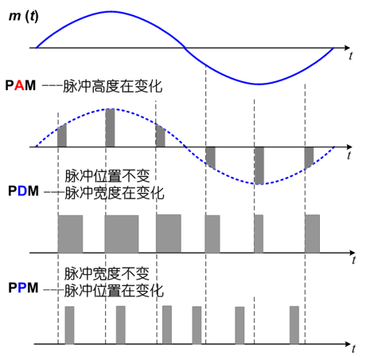
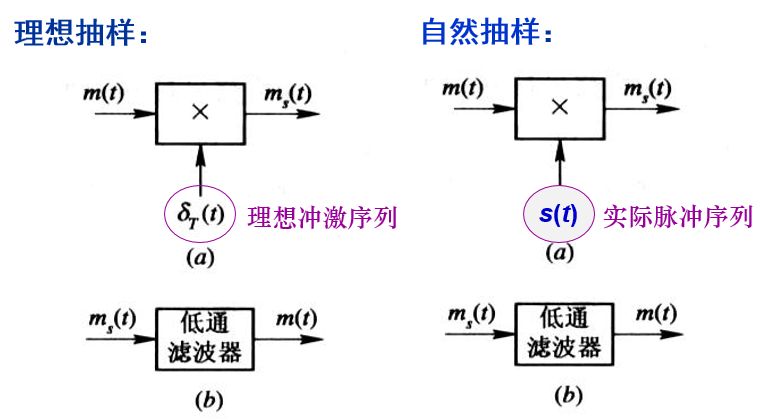
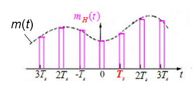
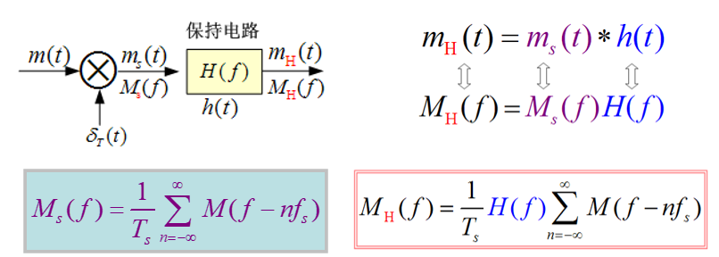
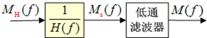
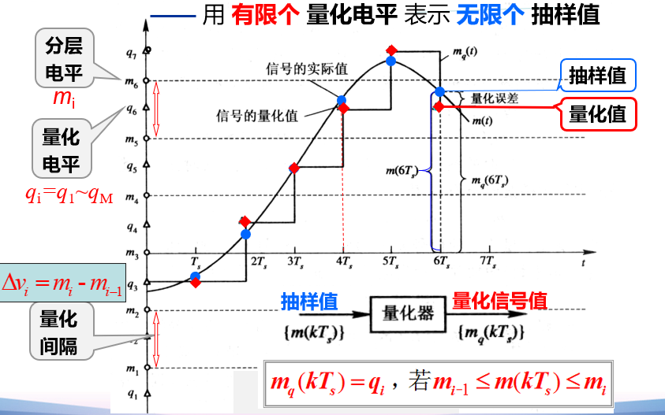
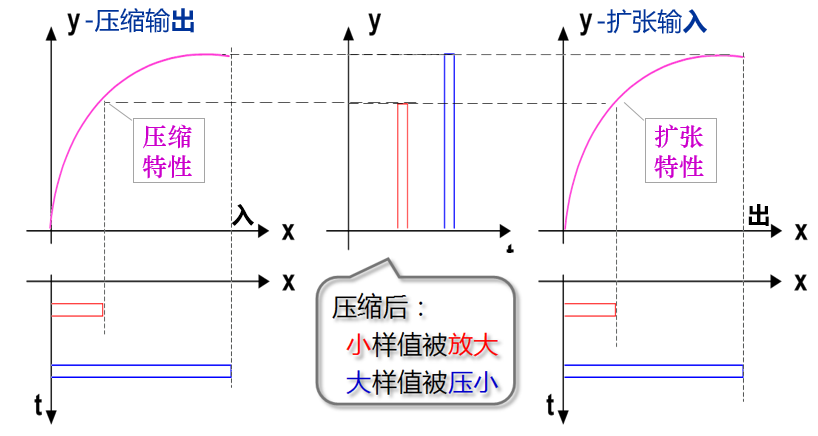
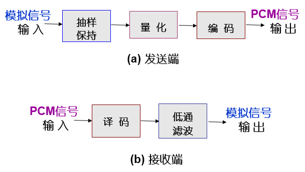
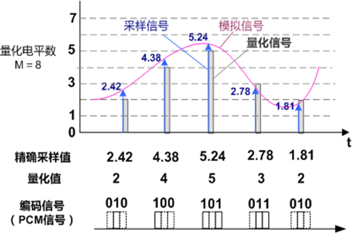
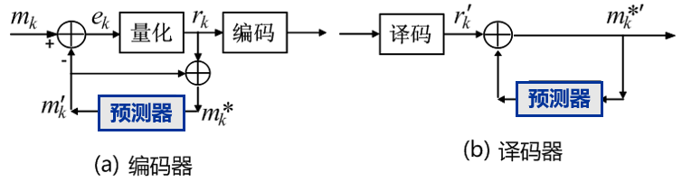

# 【现代通信原理】6 信源编码

信源编码的作用

- 压缩编码
- 模数转换

模拟信号数字化传输的三个环节

1. A/D
2. 数字方式传输
3. D/A

A/D转换（数字化编码）的技术

- 波形编码
- 参量编码

波形编码的**三个步骤**

- 抽样
- 量化
- 编码

波形编码的常用方法

- PCM
- DPCM
- ∆M

**重点**

- [ ] 模拟信号数字化 三个步骤 抽样 量化 编码

## 6.2 模拟信号的抽样

抽样定理——模拟信号数字化和时分多路复用的理论基础

### 6.2.1   低通模拟信号的抽样定理

### 6.2.2   带通模拟信号的抽样定理

## 6.3 模拟脉冲调制

### PAM、PDM、PPM、

### 实际抽样 𝟙 —— 自然抽样的PAM

###  实际抽样𝟚 —— 平顶抽样的PAM

**特点**：每个样值脉冲的顶部是平坦的。

**产生**：  抽样 保持

**恢复**：修正+低通滤波

## 6.4 模拟信号的量化

量化——幅度上离散化

量化后的信号——多电平数字信号

### 6.4.1  量化原理

用 **有限个** **量化电平** 表示 **无限个** **抽样值**

量化噪声功率：

信号 $m_k$ 的平均功率：

 

信号==量噪比==  S/Nq ——信号功率与量化噪声功率之比 ：  

### 6.4.2  均匀量化

等间隔划分输入信号的取值域

**均匀量化的缺点**

- 信号小时，量噪比小，输入信号动态范围小
- 编码位数多

应用：主要用于概率密度为均匀分布的信号，如遥测遥控信号、图像信号数字化接口中。

解决方案：非均匀量化

### 6.4.3  非均匀量化

量化间隔不相等的量化方法

**压缩**再均匀量化

- 目的：提高小信号的量噪比
- 作用：压大补小
- 特性：$y=f(x)$ 对数特性

#### 压缩率 A 、 $\mu$

一致性不好->用折线法解决

13折线近似 A 律

15折线逼近 $\mu$ 律

## 6.5 PCM 脉冲编码调制

Pulse Code Modulation, **PCM**  模拟信号数字化方式之一 

### 6.5.1 PCM的基本原理 

三个步骤：抽样、量化、编码

### 6.5.2  常用二进制码

- 自然二进码

- 格雷二进码：一位不同

- 折叠二进码：首位表极性，后位表幅度

  - 极性码：表示样值的极性。正编“1”，负编“0”

  - 段落码：表示样值的幅度所处的段落

  - 段内码：16种可能状态对应代表各段内的16个量化级

码位数N的关系

- L 为 2 的整数次幂时

$$
N = log_2{L}
$$

- L 不为 2 的整数次幂时

$$
N = \lfloor {log_2{L}} \rfloor  + 1
$$

---

后略？

### 6.5.3  电话信号的编译码器

### 6.5.4  PCM系统中噪声的影响

## 6.6 DPCM 差分脉冲编码调制

PCM的改进型，是一种预测编码方法

### 6.6.1 差分脉冲编码调制(DPCM)原理与性能

###  自适应差分脉码调制（ADPCM ，Adaptive DPCM)

ADPCM是为了改善 DPCM 的性能，而将**自适应技术**引入到量化

和预测过程。其主要特点：

① **用自适应量化取代固定量化**： **自适应量化** 指量化台阶随信号的变化而变化 ，使量化误差减小。

② **用自适应预测取代固定预测**： **自适应预测** 指预测系数可随信号的统计特性而自适应调整 ，提高预测信号的精度 。

   通过这二点改进 ，**可大大提高输出信噪比**和 **编码动态范围** 

## 6.7 增量调制(ΔM & DM)

—— 一种最简单的 DPCM

### 过载噪声

