# 【现代通信原理】4 数字基带传输

**重点**：

- [x] 什么是数字基带信号
- [x] 三个关键问题：差错、利用率、补偿
- [x] 脉冲码型：单极性多级性NRZ、单极性多级性RZ、差分、归零
- [x] 二元多元PAM，
  - [ ] 表达式原理框图，
  - [ ] 速率，传输带宽（近似：第一个过零点），性能对比

- [ ] （核心重点）理想低通系统的传输特性，以及在理想低通下基带传输的带宽与频带利用率
- [ ] （核心重点）码间串扰（基带、带通）、为什么有；无码间串扰的时域频域条件、理想低通特性、奈奎斯特带宽（最窄）、奈奎斯特速率（最快）；方法（切割、平移、叠加、对折）
- [ ] 升余弦滚降滤波器，滚降因子，求最大传输码率

---

[TOC]

## 0、引言

① 什么是数字基带信号？

未经调制的数字信号，所占据频谱从零频或很低频率开始。

② 如何传输数字基带信号？

- 数字基带传输：数字基带信号不经载波调制而直接在信道上传输。
- 数字频带传输：数字基带信号经载波调制后在信道上传输。

③ 为什么要研究数字基带传输？

- **近程**数据通信系统中广泛采用，并有迅速发展的趋势。
- 基带传输中包含了频带传输的许多**基本**问题。
- 任何一个线性调制的频带传输系统可**等效**为基带传输系统来研究  

### 数字基带传输系统模型

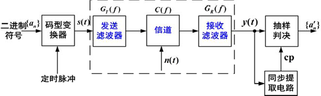
$$
H(f) = G_T(f) \cdot C(f) \cdot G_R(f)
$$

### 关键问题 

**重要**

① 如何设计总传输特性$H(f)$，使得接收端恢复出的序列{an’}与发送端序列${a_n}$之间的**差错**尽可能少？

② 如何设计总传输特性$H(f)$ ，使得在物理上可实现时，频带**利用率**尽可能高？

③ 当总传输特性$H(f)$达不到设计要求时，可以采取什么办法进行**补偿**？

 

 

 

## 1、数字基带传输信号  

### 数字脉冲幅度调制 PAM

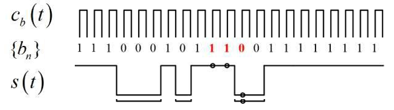

- 二进制(Binary)序列：记为0/1（或+1/-1）
- 脉冲幅度调制（PAM，Pulse Amplitude Modulation）——采用不同幅度的脉冲构建传输信号
- 时隙(Slot)：一个时隙一个符号的传输
- 定时(Timing)：接收时对准相应脉冲，检测幅度。

#### 脉冲形式（码型）

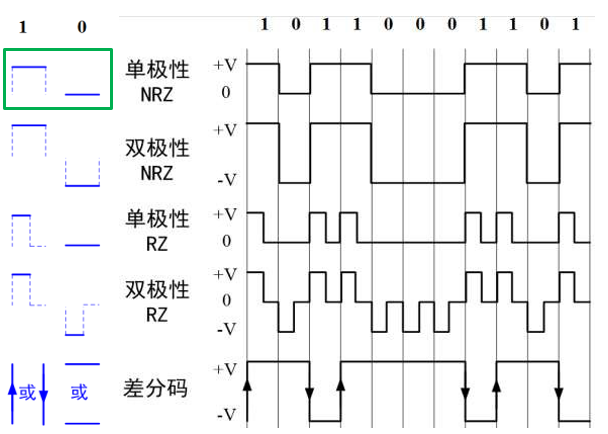

==单极性(Unipolar) 与 双极性(Polar)==

- 单极性NRZ有直流分量，连续0时无法提取定时分量
- 双极性NRZ每个码之间都有0电平间隔，0，1等概出现时无直流分量，恢复时判决电平0

==不归零(NRZ) 与 归零(RZ)==

- 单极性RZ，可直接提取定时分量
- 双极性RZ，双极性NRZ的特点+定时分量提取，容易识别码元起止时刻
- 从占空比看，RZ码占空比50%，NRZ 100%

==传号(Mark) 与 空号(Space)==

- 传号差分码:“1变0不变”
- 空号差分码:“0变1不变”

==差分码/相对码 与 电平码==

- 差分码，相对码，用差分波形传送代码可以消除设备初始状态的影响，特别是在相位调制系统中用于解决载波相位模糊问题

#### 一元PAM

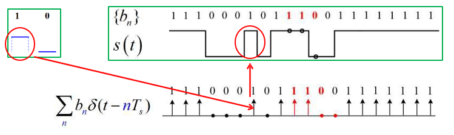
$$
s(t)=\left[\sum_{n=-\infty}^{+\infty} b_{n} \delta\left(t-n T_{s}\right)\right] * g_{T}(t)=\sum_{n=-\infty}^{+\infty} a_{n} g_{T}\left(t-n T_{s}\right)
$$

#### 多元PAM

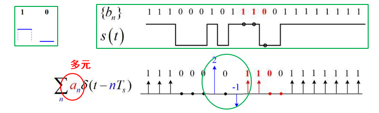
$$
s(t)=\left[\sum_{n=-\infty}^{+\infty} a_{n} \delta\left(t-n T_{s}\right)\right] * g_{T}(t)=\sum_{n=-\infty}^{+\infty} a_{n} g_{T}\left(t-n T_{s}\right)
$$

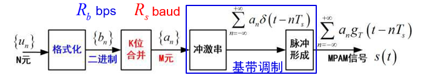

2PAM 脉冲宽度更窄， 要求定时更准

MPAM 幅度层次多，要求分辨细致，易出错

#### 速率与带宽

> **回顾第一章的有效性度量：**
>
> 数字符号的速率、传输信号的带宽
>
> **回顾计网：**
>
> Nyquist比特率（理论上最大比特率）（根据无码间串扰条件）
> $$
> \mathrm{比特率} = 2 \times \mathrm{带宽} \times \log_2{L}
> $$
> L：表示数据信号电平的数量
>
> 香农容量定理
> $$
> \mathrm{通道容量} = \mathrm{带宽} \times \log_2{(1+\mathrm{SNR})}
> $$
> 
>
> > 信噪比的计量单位是dB，其计算方法是10lg(Ps/Pn)，其中Ps和Pn分别代表信号和噪声的有效功率，也可以换算成电压幅值的比率关系：20Lg(Vs/Vn)，Vs和Vn分别代表信号和噪声电压的“有效值”

PAM传输信号是基带信号。PAM信号的带宽由脉冲形状决定。

NRZ矩形PAM信号带宽 = 无限 

主要部分：$B_T = R_S = \frac{1}{T_s} (\mathrm{Hz})$ （第一零点）

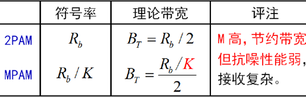
$$
B_{T}= \begin{cases}R_{s} & \text { 矩形 NRZ脉冲 (最简单) } \\ 0.5 R_{s} & \text { 理论最小值 (最 “乐观”) }\end{cases}
$$
无论是二元或多元，BW与Rs直接关联 因为，“基层”传输是按Ts进行的。

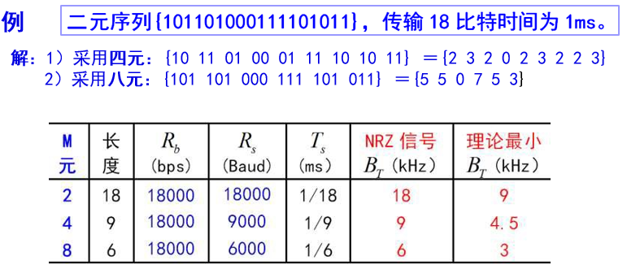

### 基带传输信号带宽计算

==TODO==

确定

- 带宽
- 直流分量
- 定时时刻

#### 1. 数字基带信号的功率谱

> 本章通过功率谱描述频谱特性可以证明$m(t)$是平稳随机过程。因此可以先推导$m(t)$的自相关函数，再求自相关函数的傅氏变换，得到数字基带信号$m(t)$的功率谱密度。

> 在通信系统中，信息符号等概率出现且符号之间互不相关。为了使频谱分析的物理概念清楚，推导过程简化，我们可以把s(t)分解成稳态波v(t)和交变波u(t)。所谓稳态波，即是随机序列s(t)的统计平均分量，它取决于每个码元内出现g1(t)、 g2(t)的概率加权平均，且每个码元统计平均波形相同在此条件下，可以推导出*m*(*t*)的功率谱密度。交变波的的功率谱Pu(f)是连续谱，它与g1(t)和g2(t)的频谱以及出现概率P有关。根据连续谱可以确定随机序列的带宽。
>
> 稳态波的功率谱Pv(f)是冲击强度取决|Ck|2的离散线谱，根据离散谱可以确定随机序列是否包含直流分量（k=0）和定时分量(k=1)。C_k----傅里叶变换系数，

可以分为两部分（忽略推导）

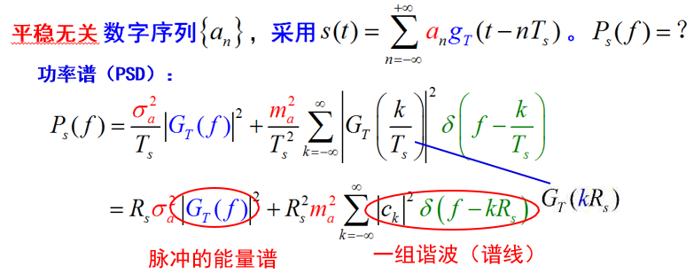

#### 2. 矩形NRZ信号的功率谱

==TODO==

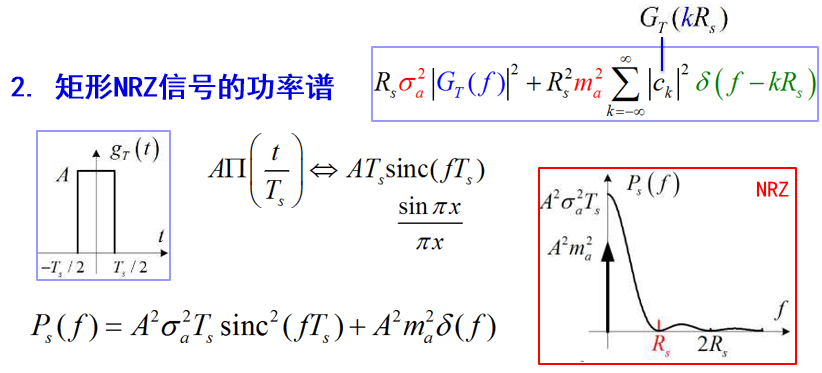

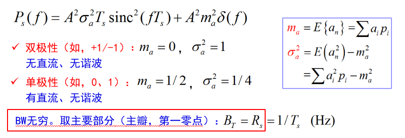

 

 

 

## 2、噪声中的接收方法与性能

1. 滤除噪声（**匹配滤波**最佳）

2. 测量波形得到**r值**

3. 通过**门限判决**（门限居“**正中**”）
4. 多元符号用**格雷编码**

**最佳基带传输**：双极性信号+匹配滤波器接收

- 双极性比单极性好3dB；

- 匹配滤波器比LPF至少好3dB

 

### 基本接收方法

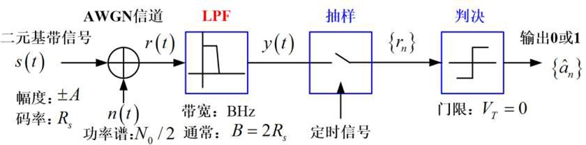

 

### 最佳接受方法

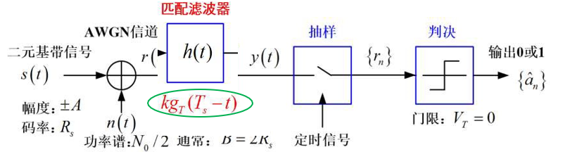

1) 匹配滤波器与脉冲 $g_{T}(t)$ “相匹配”, 在时隙末端 $t_{0}=n T_{s}$ 处抽样输出 $r_{n}$,

2) 判决门限两种输出峰值的中心。

> ==匹配滤波器==是输出端的信号瞬时功率与噪声平均功率的比值最大的线性滤波器也就是说有最大的信噪比。其滤波器的传递函数形式是信号频谱的共轭。
>
> 一、滤波器的相频特性与信号相频特性共轭，使得输出信号所有频率分量都在输出端同相叠加而形成峰值。
>
> 二、按照信号的幅频特性对输入波形进行加权，以便最有效地接收信号能量而抑制干扰的输出功率。
>
> 即当信号与噪声同时进入滤波器时，它使信号成分在某一瞬间出现尖峰值，而噪声成分受到抑制。
>
> ==TODO==

比较：

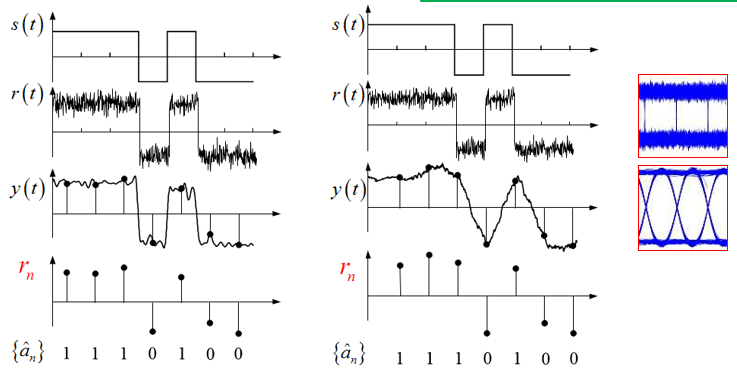

 

### 眼图

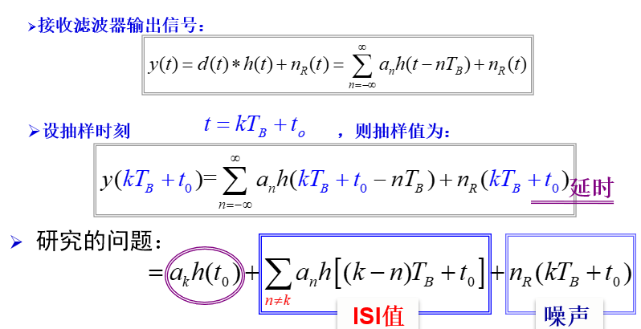

==ISI== ：码间串扰

- 如何消除 $\mathrm{ISI}$   ？

- 如何抑制  $n(t)$ ？

**眼图**

- 可以从中观察到 $\mathrm{ISI}$ 、 $n(t)$的强弱
- 指示接受滤波器的调整，以减小$\mathrm{ISI}$

**观察方法**

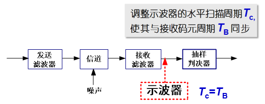

(a) 无ISI的情况——大“眼睛”(c) ，线迹细而清晰；

(b) 有ISI的情况——小“眼睛”(d)，且线迹杂乱。          

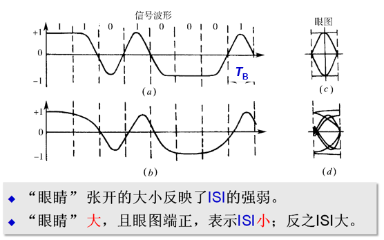

存在噪声时，眼图线迹变成了模糊的带状线；噪声越大，线条越宽、越模糊，“眼睛”张开的越小，甚至闭合。

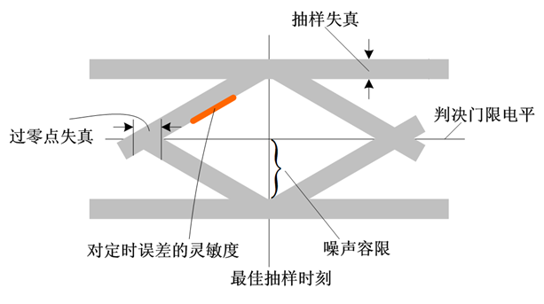

二进制双极性一个周期只有一只眼睛，M进制双极性纵向显示的M-1个，三电平AMI、HDB3扫描周期为nTB 时可以看到并排的n只眼睛

 

### 二元信号的传输性能  

#### 数字传输的可靠性指标

1) 误码 (符号) 率: $P_{e} \approx \frac{\text { 错误符号数目 }}{\text { 总传输的符号数目 }}$
2) 误比特率: $\quad P_{b} \approx \frac{\text { 错误bit数目 }}{\text { 总传输的bit 数目 }}$ 

错误的根本原因是误码, 可折合为 bit 错。

- 对于二元系统, $P_{b}=P_{e}$;
- $P_{e}$ 与 $P_{b}$ 相关联, $P_{b} \leq P_{e}, P_{b_{-} \min }=\frac{P_{e}}{K}$ 。

#### 二元传输的误码性能与曲线

*感性了解即可*

背景知识：Q函数

> 标准正态分布的右尾函数，又叫（标准正态分布的）互补累计分布函数

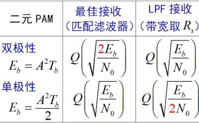

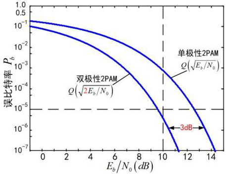

$E_b/N_0$：评价比特能量/噪声功率谱密度，反应信号噪声能量之比

**误比特率曲线比较：**

- 纵向比较：如10dB处，下边的性能较好
- 横向比较：如$10^5$处，左边的性能好3dB（12.5dB减9.5dB）。

**最佳基带传输**：双极性信号+匹配滤波器接收

- 双极性比单极性好3dB
- 匹配滤波器比LPF至少好3dB

 

### 一般多元信号的接收

#### 接收方法

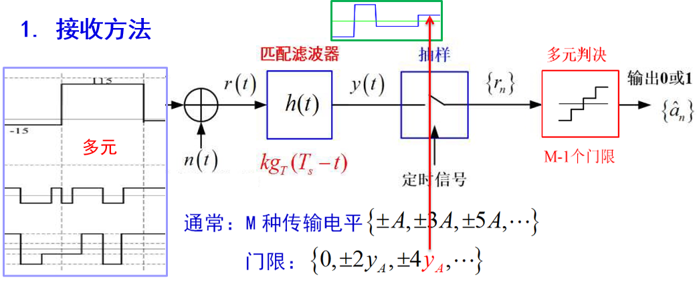

#### 最小误码率

略

#### 误码率与误比特率

最小误码率：$Q\left(\sqrt{k \frac{E_{s}}{N_{0}}}\right)$

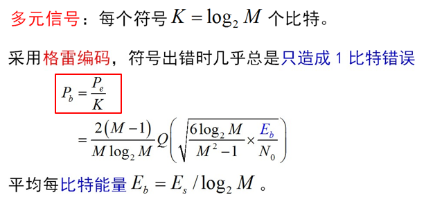

#### 格雷编码

> 背景资料

依据——传输中符号出错时几乎总是错 成相邻的符号值（因为幅度邻近）

技巧——相邻的符号值只差1bit

 

 

 

## 3、常用码型

==线路码型== Line code —— 适合于线路传输的“波形格式”

**设计原则**

- 直流分量：可否在交流耦合电路中传输； 

- 定时信息：是否包含足够的定时信息； 

- 差分编码：不必担心传输中的反相；

- 传输带宽：通常要尽量小； 

- 抗噪性能：不同的波形，抗噪能力不同； 

- 检错能力：具有规律性的特征，可检错； 

- 尽量简单。

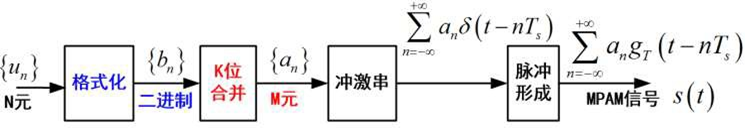

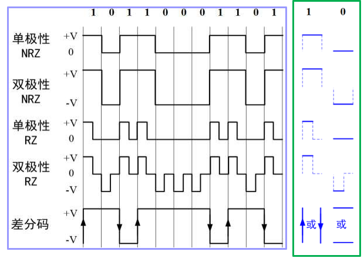

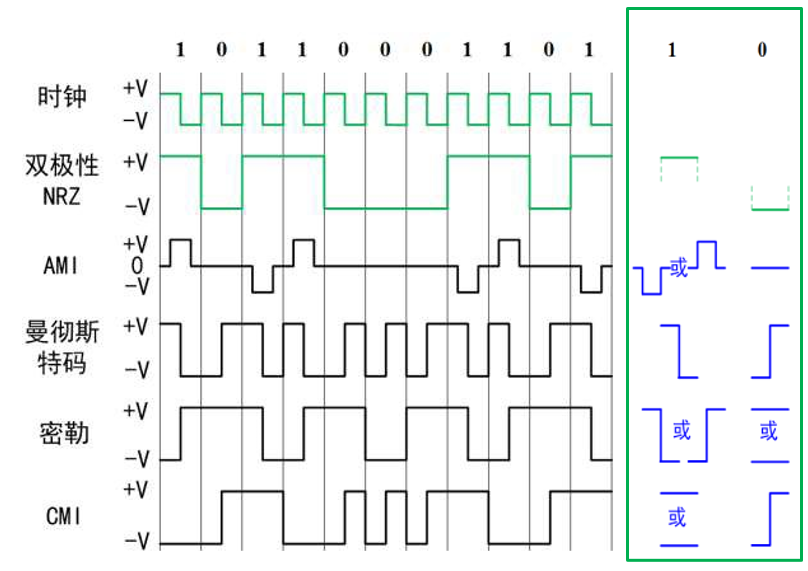

### AMI 交替传号反转码

AMI, Alternative Mark Inversion

规则：1——交替的(+1)或(-1)；0——零电平(0）

缺点：长连“0”串时，无法提取时钟。

应用：AMI码3电平信号，是北美电话系统中的接口标准之一。

### 曼彻斯特码 / 数字双相 (Biphase) 码

规则： 1——“下跳脉冲”；0——“上跳脉冲

优点：数字双相码没有直流分量，包含丰富的定时信息。

缺点：占用的带宽加大。

应用：用于10Mbps的以太网中。

### 密勒（Miller）码 / 延迟调制码

密勒（Miller）码/延迟调制码

规则： 1——“下跳”或“上跳脉冲”；0——负或正电平，连0时要交替。

优点：密勒码是数字双相码经过一级触发器后的结果，克服了数字双相码的定时相位不确定性。==？==

### CMI 传号反转码

传号反转码(CMI) 

规则：1——交替的正或负电平；0——上跳脉冲

特点：没有直流分量，跳变丰富，容易接收、易于检错。

应用：ITU-T建议的一种接口标准。

### HDB3 3阶高密度双极性码 （ AMI码的改进）

规则：

1) 先进行AMI编码

2) 检查连0，四个以上时，插入“**破坏码元V**”

特点：HDB3具有AMI码的优点，译码简单，且容易提取定时时钟。

应用：ITU-T推荐使用的码型之一。

规则：

1) 先进行AMI编码（B为+1或-1）。 

2) 检查连0，将0000替换为  000V或B00V（V为破坏元，+1或-1 ）使B正负交替、 V正负交替；V与前面B同极性。

==TODO：结合计网==

 

 

 

## 4、带限信道上的传输方法

 

### 码间串扰与Nyquist准则

#### 码间串扰

Inter-Symbol Interference，码间干扰

#### Nyquist 准则（无 ISI）

 

### 带限信道的传输方法

#### 带限信道的频率响应  

#### 无 ISI 分析  

#### 升余弦滚降滤波器

 

### 带限AWGN信道的最佳传输

#### ISI问题

 

### 无码间串扰的基带传输特性

#### 消除码间串扰的设计思想

#### 无码间串扰的条件

时域条件

频域条件

### $H(\omega)$的设计 

#### 理想低通特性

#### 余弦滚降特性

 

 

 

# 参考

## 作业

**设随机脉冲序列的码元速率为1200Baud，问：**

（1）采用单极性归零码时，求其第一零点带宽，并画出功率谱密度图。

（2）采用双极性不归零码，求其第一零点带宽，并画出功率谱密度图。

---

**某采用四进制信号传输的基带系统其总频率特性|H(f)|是滚降系数为0.4、绝对带宽为7kHz的余弦滚降特性。**

（1）求无ISI传输时的最高比特信息速率和最高频带利用率（b/s/Hz）

（2）以15kb/s的比特速率传输时，有无ISI？
