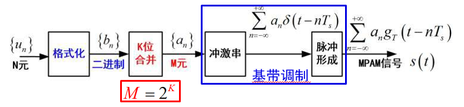

# 【现代通信原理】4 数字基带传输

**重点**：

- [ ] 什么是数字基带信号

- [ ] 三个关键问题

- [ ] 脉冲码型：单极性多级性NRZ、单极性多级性RZ、差分、归零

- [ ] 二元多元PAM，表达式原理框图，速率，传输带宽（近似：第一个过零点），性能对比

- [ ] （核心重点）理想低通系统的传输特性，以及在理想低通下基带传输的带宽与频带利用率

- [ ] （核心重点）码间串扰（基带、带通）、为什么有；无码间串扰的时域频域条件、理想低通特性、奈奎斯特带宽（最窄）、奈奎斯特速率（最快）；方法（切割、平移、叠加、对折）

- [ ] 升余弦滚降滤波器，滚降因子，求最大传输码率

---

[TOC]

## 0、引言

① 什么是数字基带信号？

未经调制的数字信号，所占据频谱从零频或很低频率开始。

② 如何传输数字基带信号？

- 数字基带传输：数字基带信号不经载波调制而直接在信道上传输。
- 数字频带传输：数字基带信号经载波调制后在信道上传输。

③ 为什么要研究数字基带传输？

- **近程**数据通信系统中广泛采用，并有迅速发展的趋势。
- 基带传输中包含了频带传输的许多**基本**问题。
- 任何一个线性调制的频带传输系统可**等效**为基带传输系统来研究  

### 数字基带传输系统模型

$$
H(f) = G_T(f) \cdot C(f) \cdot G_R(f)
$$

### 关键问题 

**重要**

① 如何设计总传输特性*H*( *f* )，使得接收端恢复出的序列{an’}与发送端序列{an}之间的**差错**尽可能少？

② 如何设计总传输特性*H*( *f* ) ，使得在物理上可实现时，频带**利用率**尽可能高？

③ 当总传输特性*H*( *f* )达不到设计要求时，可以采取什么办法进行**补偿**？

## 1、数字基带传输信号  

### 数字脉冲幅度调制 PAM

- 二进制(Binary)序列：记为0/1（或+1/-1）
- 脉冲幅度调制（PAM，Pulse Amplitude Modulation）——采用不同幅度的脉冲构建传输信号
- 时隙(Slot)：一个时隙一个符号的传输
- 定时(Timing)：接收时对准相应脉冲，检 测幅度。

#### 脉冲形式（码型）

单极性(Unipolar)与双极性(Polar)

不归零(NRZ)与归零(RZ) 

传号(Mark)与空号(Space) 

差分码/相对码与电平码

传号差分码:“1变0不变”

空号差分码:“0变1不变”

#### 二元PAM

$$
s(t)=\left[\sum_{n=-\infty}^{+\infty} b_{n} \delta\left(t-n T_{s}\right)\right] * g_{T}(t)=\sum_{n=-\infty}^{+\infty} a_{n} g_{T}\left(t-n T_{s}\right)
$$

#### 多元PAM

$$
s(t)=\left[\sum_{n=-\infty}^{+\infty} a_{n} \delta\left(t-n T_{s}\right)\right] * g_{T}(t)=\sum_{n=-\infty}^{+\infty} a_{n} g_{T}\left(t-n T_{s}\right)
$$

2PAM脉冲宽度更窄， 要求定时更准

MPAM幅度层次多，要 求分辨细致，易出错

#### 速率与带宽

> 回顾第一章的有效性度量：
>
> 数字符号的速率、传输信号的带宽

## 2、噪声中的接收方法与性能

### 基本接收方法

### 最佳接受方法

### 眼图

### 二元信号的传输性能  

#### 数字传输的可靠性指标

#### 二元传输的误码性能

#### 二元信号的误码曲线

### 一般多元信号的接收

#### 接收方发

#### 最小误码

#### 误码率与误比特率

#### 格雷编码

## 3、常用码型

==线路码型== Line code —— 适合于线路传输的“波形格式”

**设计原则**

直流分量：可否在交流耦合电路中传输； 

定时信息：是否包含足够的定时信息； 

差分编码：不必担心传输中的反相；

传输带宽：通常要尽量小； 

抗噪性能：不同的波形，抗噪能力不同； 

检错能力：具有规律性的特征，可检错； 

尽量简单。

### 交替传号反转码（AMI）

规则：1——交替的(+1)或(-1)；0——零电平(0）

特点：长连“0”串时，无法提取时钟。

应用：AMI码3电平信号，是北美电话系统中的接口标准之一。

### 曼彻斯特码/数字双相 (Biphase) 码

规则： 1——“下跳脉冲”；0——“上跳脉冲

特点：数字双相码没有直流分量，包含丰富的定时信息。但占用的带宽加大。

应用：用于10Mbps的以太网中。

### 密勒（Miller）码/延迟调制码

密勒（Miller）码/延迟调制码

规则： 

- 1——“下跳”或“上跳脉冲”；
- 0——负或正电平，连0时要交替。

特点：密勒码是数字双相码经过一级触发器后的 结果，克服了数字双相码的定时相位不确 定性。

### 传号反转码(CMI) 

传号反转码(CMI) 

规则：1——交替的正或负电平；0——上跳脉冲

特点：没有直流分量，跳变丰富，容易接收、易于检错。

应用：ITU-T建议的一种接口标准。

### HDB3——3阶高密度双极性码 （ AMI 码的改进）

规则：

1)先进行AMI编码

2)检查连0,四个以上时，插入“破坏码元V”

特点：HDB3具有AMI码的优点，译码简单，且容易提取定时时钟。

应用：ITU-T推荐使用的码型之一。

规则：

1)先进行AMI编码（B为+1或-1）。 

2)检查连0，将0000替换为  000V或B00V（V为破坏元，+1或-1 ）使B正负交替、 V正负交替；V与前面B同极性。

## 4、带限信道上的传输方法

### 码间串扰

Inter-Symbol Interference，码间干扰

### Nyquist 准则（无 ISI）

### 带限信道的频率响应  

### 无 ISI 分析  

### 升余弦滚降滤波器

### ISI问题

### ...

