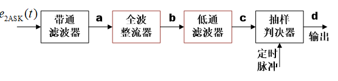
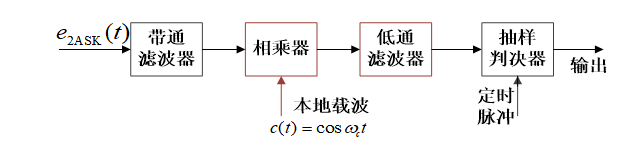

# 【现代通信原理】5 数字带通传输

**重点**

- [ ] 各种调制的原理框图、表达式、第一过零点带宽

- [ ] 相干解调、包络解调

- [ ] 调制误码的性能、带宽、曲线图（各种特性相互比较）

- [ ] 多进制调制的引入、代价、可靠性有效性、曲线图对比...FSK的特别性

[TOC]

## 概述

数字调制：可以看作是M进制符号集到M个载波构成的载波集的映射

实现数字调制的两种*基本方法*

- 利用**模拟调制**的方法去实现数字调制；
- 通过开关键控载波，通常称为**键控法**
  - 振幅键控(ASK)
  - 频移键控(FSK)
  - 相移键控(PSK)

 

 

 

## 二进制数字调制

### 2ASK (OOK) 二进制振幅键控

#### 表达式

$$
e_{\mathrm{2ASK}}(t)=s(t)cos{\omega_c}t
$$

#### 调制

#### 解调

**包络检波法**

**相干解调法**

噪声电压和信号共同对振幅产生影响，根据振幅识别比特会带来误码

 

### 2FSK 二进制频移键控

FSK可视为两个不同载频的2ASK的叠加

#### 表达式

$$
e_{\mathrm{2FSK}}(t)=\left[\sum_{n}{a_ng(t-nT_s)}\right]\cos{(}\omega_1t+\phi_n)+\left[\sum_{n}{{\overline{a}}_ng(t-nT_s)}\right]\cos{(}\omega_2t+\theta_n)
$$

化简：

$$
e_{\mathrm{2FSK}}\left(t\right)=s_1\left(t\right)\cos{\omega_1}t+s_2\left(t\right)\cos{\omega_2}t
$$

#### 调制

**模拟调频法：**相邻码元之间的相位是连续变化的。

**键控法：**相邻码元之间的相位不一定连续。

**优点**：转换速度快、电路简单、产生的波形好、频率稳定度高。

#### 解调

**包络检波**

非相干解调，分上下两路分别解调，判决，不需要设定门限

**相干解调**

**其他解调方法**：鉴频法、差分检测法、过零检测法等。

 

### 2PSK 二进制相移键控

振幅和频率不变，表示信号的两种码元波形相同，极性相反，可以表示为一个双极性全占空矩形脉冲序列与一正弦波相乘。发0时a_n取1，发1时a_n取-1

#### 表达式

#### 调制

#### 解调

与2ASK相比，对s(t)的要求不同，前者单极性，后者双极性基带信号。解调使用相干解调。

解调时假设相干载波与基准相位同相，2PSK载波恢复时存在180度相位模糊，涉及到同步问题，实际很少采用，长时间连续正弦波可能会使接收端无法确定码元起止时间。

 

### 2DPSK 二进制差分相移键控

Differential PSK 

为了解决2PSK的问题，讨论差分相移键控，以未调载波相位为参考基准，绝对相移。由于倒$\pi$问题，解调可能出现反向工作，2DPSK，相对相移键控。对于A方式，解决了载波相位不确定问题，但对长码元仍存在码元定时问题。改用B方式，相邻码元间必有相位突跳。后者应用广泛。

利用前后相邻码元的载波相对相位表示信息。

#### 调制

先对二进制基带信号差分编码，由绝对码变换为相对码，再对相对码进行绝对调相，产生2DPSK。

**差分编码规则**：$b_n = a_n \oplus b_{n-1} $

#### 解调

相干解调 + 码反变换法 $a_n = b_n \oplus b_{n-1} $

2DPSK 差分相干解调 (相位比较)法

 

 

 

## 多进制数字调制

$$
𝑅_𝑏=𝑅_𝐵  \log_2⁡M
$$

**目的**：提高信道的频带利用率

**代价**：误码率增大（判决范围减小），系统复杂

>几种二进制调制的误码率，解调器输入端信噪比r是e的负指数

MASK、MFSK、MDPSK、MQSK

### MASK 多进制振幅键控

MASK可看成是二进制振幅键控（2ASK）的推广

MASK信号的功率谱 与 2ASK信号具有相似的形式;

谱零点带宽是 M 进制数字基带信号带宽的两倍。

$$
B=2R_B=\frac{2R_b}{\log _2M}
$$

$$
B=\frac{2}{T_B}=\frac{2}{T_b\cdot \log _2\!\:M}
$$

在 Rb相同时，MASK信号带宽是 2ASK的 1 / log2M 倍 。

MASK的抗噪声能力差，常用多进制正交振幅调制（MQAM）来代替

#### 调制

与2ASK的产生方法相似，区别在于:

发送端输入的二进制数字基带信号需要先经过电平变换器转换为M电平的基带脉冲，然后再去调制。

#### 解调

与2ASK信号解调也相似，有相干和非相干解调两种。

 

### MFSK 多进制频移键控

MFSK需要M个频率，要降低误码率就需要增大信号强度

要求载频之间的距离足够大，以便用滤波器分离不同频率的谱。

MFSK信号占用较宽的频带，信道频带利用率不高。
$$
B=\left| f_M-f_1 \right|+\frac{2}{T_B}
$$
MFSK一般用于 调制速率$(1/T_B)$ 不高的衰落信道传输场合。

#### 调制解调

 

### MPSK 多进制相移键控

利用载波的M种不同**相位**表示数字信息。

$M$ 增加

- 提高频带利用率
- 抗噪性能下降，设备复杂。（判决范围减小、噪声容限减小）

> 多进制PSK不能采用一个相干载波进行解调，存在相位模糊问题，$cos\theta_k=cos(2\pi-\theta_k)$
>
> 令振幅$A=1, s_k(t)=cos(\omega_0*t+\theta_k)=a_k*cos(\omega_0*t)+b_k*sin(\omega_0*t)$,可以看做是正弦和余弦两个正交分量合成。$a_k^2+b_k^2=1$。MPSK信号可以看做是两个MASK信号码元之和，带宽与MASK相同。

### QPSK（4PSK) 正交相移键控

M=4时，quadrature Phase Shift Keying，**Q**PSK，每个码元用两比特表示，对应四种相位之一

*对应关系可有不同规定，但相邻码组应符合格雷码编码规则*

*波形和相位不连续、波形连续相位不连续，相位不连续时，最大相位跳变180°，使限带的QPSK信号包络起伏很大，并出现包络零点，有时将码元周期包含整个载波周期的假设隐含不提，认为PSK信号初始相位相同，则码元边界瞬时相位一定连续*

**相位跳变**：0°, ± 90°, ± 180°       

**跳变周期**：$2T_b$

**带宽**：$B=R_b$

**QPSK缺点**：

- 最大相位跳变180°，使**限带**的QPSK信号包络起伏很大，并出现包络零点 -> 出现旁瓣
- 频谱扩展大，旁瓣对邻道干扰大 -> 引起ISI

#### 调制

**正交调相法**

**相位选择法**

#### 解调

**原理**：分解为两路2PSK信号的相干解调。

*两路正交信号叠加，用两路相干载波去解调*

**存在问题**：存在900的相位模糊（0, 90, 180, 270）       

**解决方案**：采用四相相对相位调制，即Q**D**PSK。

### OQPSK 偏置或交错 QPSK

Offset QPSK

> **QPSK缺点**：
>
> - 最大相位跳变180°，使**限带**的QPSK信号包络起伏很大，并出现包络零点 -> 出现旁瓣
> - 频谱扩展大，旁瓣对邻道干扰大 -> 引起ISI

**改进思路：**

信号点不作对角线移动即双比特ab不同时跳变

相位跳变 0或± 90°

在**QPSK**基础上，将两个正交分量的比特a、b**错开**半个码元（1bit时间），使a、b不可能同时改变

限带QPSK 与 限带OQPSK 对比： 

  

### MDPSK 多进制差分相移键控

原理与 2DPSK 类似：利用相邻码元载波的相对相位变化 表示 数字信息。

4DPSK 也称 QDPSK

QDPSK与QPSK的关系，如同2DPSK与2PSK关系

QDPSK的矢量图与QPSK的矢量图相似——只是参考相位是前一码元的载波相位

#### 调制解调

也有**正交调相法** 和 **相位选择法**

仅需在QPSK调制器基础上增添**差分编码（码变换）**

**相干解调（**极性比较**）**+码反变换

**差分相干解调（**相位比较法）

 

### 误码率分析

*细节略*

MASK -相干解调系统

MFSK –非相干解调

MFSK –相干解调

**MPSK 和 MDPSK**

 

 

## 信号空间与2D频带信号

### 星座图的排布原则

在2-D平面充分排布，应该注意：

- 加大彼此距离 —— 距离大Pe小
- 控制平均能量$E_s$——同等功率

实用规则：

- 分布均匀：使所有距离尽量大，最小相邻$d_{min}$是总Pe的“瓶颈”
- 收缩区域（能量对应信号的模长，对应于区域大小） 总体居中（同等结构，重心位于原点的，总能量最小）
- 尽量格雷编码。

$$
E_s=\frac{1}{M} \sum E_i = \frac{1}{M} {||s_i||}^2
$$

右边的排列更好

---

## 传输系统结构与信号带宽

系统中存在两个完整的基带传输支路：

- 成形脉冲——构建RC谱特性，实现无ISI
- 匹配滤波——SRC配对，达到最大SNR解调，实现最佳传输

## 频带调制的特性与比较

## FSK

## OOK与FSK的非相干接收

## OFDM 正交频分复用 

# 参考

## 作业

**某系统采用MPSK调制方式，在加性白高斯噪声信道上以50kb/s的速率传输数据。假设系统频域传输特性是滚降系数等于1的升余弦函数，系统带宽为50kHz。求：**

（1）MPSK调制中的M等于多少？

（2）无 ISI&nbsp;的最高频带利用率(b/(s*Hz))是多少？

**某系统采用MPSK调制方式，在加性白高斯噪声信道上以50kb/s的速率传输数据。假设系统频域传输特性是滚降系数等于1的升余弦函数，系统带宽为50kHz。求：**

（1）MPSK调制中的M等于多少？

（2）无ISI&nbsp;的最高频带利用率(b/(s*Hz))是多少？