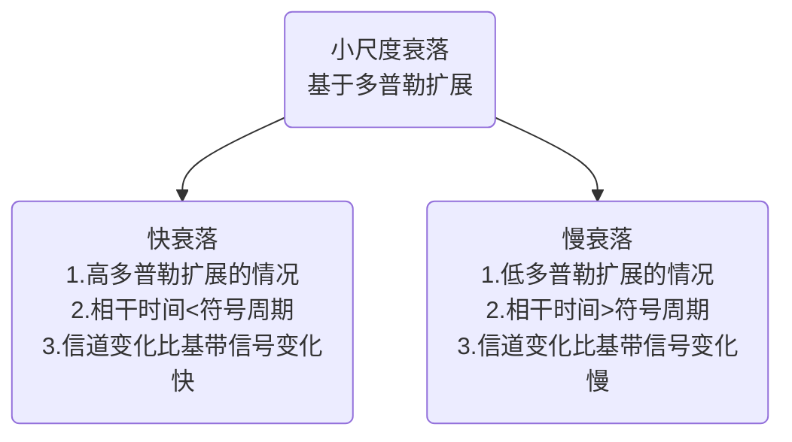
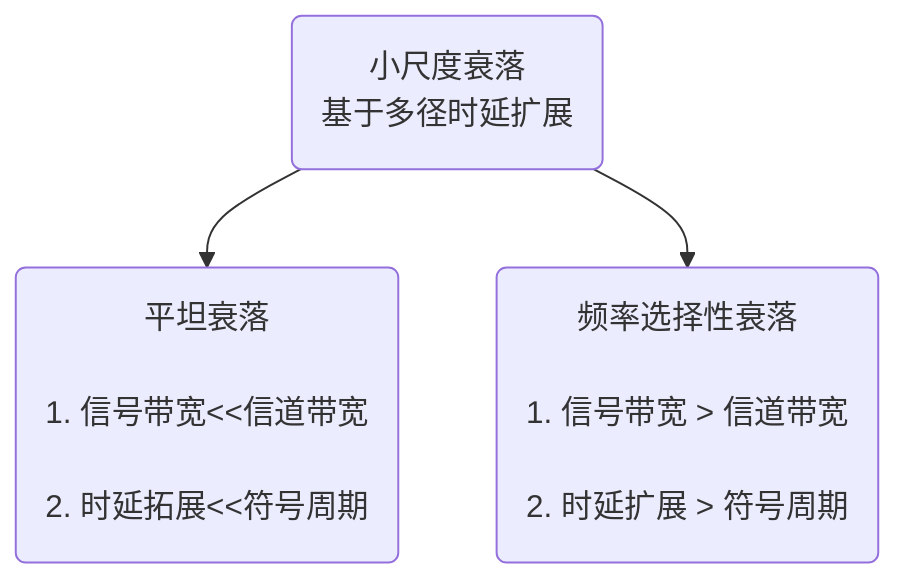

# 【现代通信原理】2 无线信道的传播特征

**重点：**

* [X] 四种传播方式、四种效应、三种衰落
* [X] 自由空间模型：空间损耗公式适用范围、天线远场区、参考距离的计算；LOS近似公式
* [X] 双线模型、第一菲涅尔区、简化的双线模型（仅了解）

---

* 无线信道的**损伤性**

加性的，乘性的；  
时间上的，频率上的；  
干扰，周围环境噪声；  
快变化的，慢变化的等等

* 无线信道的**复杂性**

信道的特性随时间不同而发生变化

[TOC]

## 2.1 多径传播环境

### 无线通信信号的*四种传播方式*

**四种最基本传播方式**：

==直射==：发射机信号无阻挡到达接收机。

==反射==：当电磁波遇到比波长大得多的物体时发生反射，反射发生在地球表面、建筑物和墙壁表面。

==绕射==：当接收机和发射机之间的无线路径被尖锐的边缘阻挡时将发生绕射。

==散射==：当波穿行的介质中存在小于波长的物体并且单位体积内阻挡体的个数非常巨大时，将发生散射。散射发生于粗糙表面、小物体或其他不规则物体。

一般情况下，相对于直射波，反射波、绕射波、散射波都比较弱。

电波传播特性主要由其频率值的大小决定。

空中传播时主要有三种模式：

* ==地波==（ Ground-Wave ）模式——电波沿地表面弯曲传播方式

  * 2MHz 以下的电波主要按这种模式传播
  * 大致可以传输几十公里，在海洋上可以传播更远一些。
  * 主要用于越洋通信、海事广播等。
* ==天波==（ Sky-wave ）模式——电波经天空中电离层反射而折回地  
  面的传播方式。

  * 电离层（ Ionosphere ）——大气层受太阳紫外线与宇宙射线照射后产生的离子层，约地面 60~400km 高处。
  * 3-30MHz 的电波反射可以达到几百 ~ 1000km 远，多次反射可传更远
  * 主要用于长距离通信，军事的、政府的、企业的等，也有短波广播 电台。
  * 电离层周期性时变的，短波信道也是时变的。
* ==视线==（ LOS, Line-of-sight ）模式

  * 高于 30MHzMHz ，直到光波，都主要以这种方式传播
  * 向上传播时会穿透电离层而不被反射回来
  * 地面传播时，如遇到遮挡，信号会被阻断会显著衰减

==流星余迹通信==

* 通信距离远，单跳跨距可达 2000 公里
* 传输信道由流星进入大气层形成 ,无需申请转发器
* 应用地域不受限制，从极地到赤道都可使用
* 支持全时域、全天候工作
* 工作频率： 40MHz ～ 50MHz
* 业务种类：短消息、数据报文
* 最佳通信距离： 600~1300km
* 突发传输速率： 4kb/s ～ 64kb/s( 自适应可变 )
* 年平均数据通过量： 100 字符 /分钟

### 接收信号中的*四种效应*

#### 阴影效应

由于大型建筑物和其它物体的阻挡，在电波传播的接收区域中产生传播半盲区。

#### 远近效应

由于用户的随机移动性，发射机与接收机之间的距离也是在随机变化。若发射机发射信号功率一样，那么到达接收机时信号的强弱将不同，离接收机近者信号强，离接收机远者信号弱。

#### 多普勒效应

**多普勒频移（频率色散）**

由于用户处于高速移动（如车载通信）中，传播频率的扩散而引起的，其频率扩散程度（多普勒频移）与用户运动速度成正比。

$$
f_{d}=\frac{V}{\lambda} \cos \theta(t)=\frac{V f_{c}}{c} \cos \theta(t)
$$

*主要是$V/c$*

* **频率的扩展对应于时间的相干程度**

==信道的相干时间==

**信道的相干时间**与最大多普勒频移之间呈反比关系，这就是说，信道所造成的频率扩展程度越明显，该信道的相干时间就越短——对不同时间分量的选择性就越强。反之，相干时间会越长——不同时间分量将经历相似的衰落，信道对不同时间分量的影响是相似的。

信道的相干时间是一个时间区间的概念，这个时间区间越短就意味着信道响应随时间变化的越快。 比如，在一辆高速移动的汽车上进行接收信号测量，在同样的时间段上观察，相对于另一辆低速移动的汽车上进行同样的测量，前一种情形下接收信号将经历更多的变化。

* **基于多普勒频率扩展的小尺度衰落分类：**

#### 多径效应

它们到达时的信号强度、信号相位、信号频率、信号方向都是不一样的。

所接收到的信号是上述各路径信号的矢量和。称这种自干扰现象为多径干扰或多径效应。

**多径时延（时间色散）**

同一发射信号通过不同路径到达接收端，它到达的时间*先后*和*强度*会有不同。到达信号之间不同的时间差，称为存在多径时延。

多径时延对数字移动通信有极其重要的影响。

==信道的相干带宽==

**多径信道所造成的时间延迟程度越明显，该信道的相干带宽就越窄**——*对传输信号中不同频率分量的选择性就越强*。反之，相关带宽会越宽——不同频率分量将经历相似的衰落，信道对不同频率分量的影响是相似的。

另一方面，较大的多径时延会引起码间干扰，导致接收信号的时域波形失真，这时为克服**码间干扰的**影响，在接收端一般要设置均衡器。（就像音响里那种均衡器）

基于多径时延扩展的小尺度衰落分类

### 三种**衰落**（Fading）

接收信号电平随距离或时间波动，这种现象称为衰落

#### 大尺度路径损耗（ Large-Scale Path Loss ）

* 电磁波在空间传播，距离所产生的损耗
* 千米量级

#### 阴影损耗（中尺度损耗）（ Shadowing ）

* 由传播阻挡的阴影效应所产生的损耗
* 数百波长量级

#### 小尺度衰落（Small-Scale Fading 快衰落）

* 反映小范围接收电平平均值的起伏变化趋势
* 数十波长以下量级
* 衰落深度可达 20 － 40dB 。
* 电平幅度分布一般遵循：瑞利（ Rayleigh ）分布、莱斯（ Rice ）分布、纳卡伽米（ Nakagami ）分布等。
* 变化速率快。
* 具有**选择性**。即在不同频率、不同时间、不同空间，其衰落特性是不一样的。
* 是无线移动通信中**最难克服**的衰落。

*固定无线通信与移动无线通信相比，是否都存在小尺度衰落？* 常见于移动通信。

*慢衰落：相对于信号时间很长*

## 2.2 大尺度路径损耗与阴影衰落

无线信道是一个完全开放式信道，其传播损耗从宏观的大范围看，主要决定于*传播的环境*。

传播损耗不仅决定于*传播距离*，而且还与传播中的*地形、地貌、传播的载波频率、功率*，以及*发、收天线高度*等密切相关。

从理论角度给出一个确切、完整的公式很困难。一般在工程上多采用一些*模型与经验公式*，它对于工程技术人员而言已基本上能满足工程上的*估算*要求

### **dB**

* 几个常用**单位**：

dB = $10\log{x}$

dbW = $10\log{\frac{x}{1W}}$ 表示大于或小于 1 瓦的分贝数

dbmW (dBm) = $10 \log{\frac{x}{1mW}}$ 表示大于或小于 1 毫瓦的分贝数

*平方项，所以系数是10*

* 几个重要**概念**：

**3dB** 的概念

功率每增加一倍，其分贝值 (如 dBm) 增大 3dB ；反之，功率每减小一半，其分贝值减少反之，功率每减小一半，其分贝值减少3dB 。

**1dB** 的概念

功率每增加 25 ％，其分贝值增大约1dB(1.25 取对数）；反之，功率每减小一半，其分贝值减少反之，功率每减小 20 ％，其分贝值减少约 1dB (0.8 取对数）

30dbm~1W

37dbm~5W

40dbm~10W

47dbm~50W

50dbm~100W

* 实测数据：

GSM 基站 (BS) 接收机灵敏度典型值为：-104dBm ；

GSM 手持移动台 (MS) 接收机灵敏度典型值为：-102dBm 。

（ -100dBm 相当于 $10^{-10}$ mW ）

### 2.2.1 自由空间传播模型

自由空间传播模型：计算*完全无阻挡*的视距路径时接收信号的功率

==理想无线信道==：无阻挡、无吸收、无时变、无干扰，自由空间传播。

无线电波在自由空间传播时，其单位面积中的能量会因为扩散而减少。这种减少，称为自由空间的传播损耗。

#### 本节公式与结论

**自由空间中距发射机 d 处天线的接收功率为：**

$$
P_{r}=P_{t} G_{t} G_{r}\left(\frac{\lambda}{4 \pi d}\right)^{2}
$$

**自由空间路径损耗：**

$$
L_{p}(d)=20 \log \left(f_{c}\right)+20 \log (d)+32.44  ~ (\mathrm{dB})
$$

**d 处的接收功率与参考距离 d0 的接收功率的关系：**

$$
P_{r}(d)=P_{r}\left(d_{0}\right)\left(\frac{d_{0}}{d}\right)^{2} \quad d \geq d_{0} \geq d_{f}
$$

**两个天线之间直线传播最大距离是：**

$$
4.12\left(\sqrt{h_{t}}+\sqrt{h_{r}}\right)(\mathrm{km})
$$

#### Friis 公式 定义

$\lambda$ 信号波长；$d$ 距离 (m)

$P_t$ 发射功率；$P_r$ 接受功率

$G_t$ 发射天线增益；$G_r$ 接受天线增益

自由空间中距发射机 d 处天线的**接收功率**为：

$$
P_{r}=P_{t} G_{t} G_{r}\left(\frac{\lambda}{4 \pi d}\right)^{2}
$$

通常直接定义$\left(\frac{4 \pi d} {\lambda} \right)^{2}$ 为**自由空间路径损耗** $L_{p}(d)$

自由空间路径损耗 $L_{p}(d)$：$f_c$(MHz) $d$ (km)

$$
L_{p}(d)=20 \log \left(f_{c}\right)+20 \log (d)+32.44  ~ (\mathrm{dB})
$$

距离每增加一倍或发射频率每增加一倍，自由空间损耗就增加**6dB**

#### Friis 公式 适用范围

**仅适用于天线远场区**

==天线远场区==（Fraunhofer区）为超过远场距离 $d_f$ 的地区

远场距离 $d_f$ :

$$
d_{f}=\frac{2 D^{2}}{\lambda}
$$

$D$ 为天线的最大物理线性尺寸也称天线孔径

**参考距离**

$$
P_{r}(d)=P_{r}\left(d_{0}\right)\left(\frac{d_{0}}{d}\right)^{2} \quad d \geq d_{0} \geq d_{f}
$$

#### 大气效应

* 吸收衰减

  * 高频段
* 雨雾衰减

  * 在10GHz以下频段，雨雾衰减并不严重，一般只有几dB。
  * 在10GHz以上频段，雨雾衰减大大增加，达到几dB/km。
  * 下雨衰减是限制高频段微波传播距离的主要因素
* 大气折射

  * 影响通常等效为地球半径发生了变化
  * 对于超短波波段，折射现象尤为突出它会影响到视距的极限传播距离。

#### 视距（LOS）的极限传播距离

（修正之后的）

$R_e$：等效地球半径

$h_{t/r}$ ：天线高度

两个天线之间直线传播最大距离是：

$$
4.12\left(\sqrt{h_{t}}+\sqrt{h_{r}}\right)(\mathrm{km})
$$

#### 例题

### 2.2.2 光滑平面上的电波传播

反射的条件：当电波传播中遇到两种不同介质的光滑可反射平面（如地球的表面或水面）时，如果界面的尺寸远大于电波的波长时，产生反射。

反射的表现：反射角＝入射角

地面反射模型（双线模型、两径模型）

#### 本节公式与结论

**地面反射模型（双线模型）:**

*注意有的单位是千米有的是米*

**接收功率**

$$
P_{r}(d) \approx 4 P_{t} G_{t} G_{r}\left(\frac{\lambda}{4 \pi d}\right)^{2} \sin ^{2}\left(\frac{2 \pi h_{t} h_{r}}{\lambda d}\right)
$$

**双线模型路径损耗**

$$
L_{p}(d)=-10 \log \left[4\left(\frac{\lambda}{4 \pi d}\right)^{2} \sin ^{2}\left(\frac{2 \pi h_{t} h_{r}}{\lambda d}\right)\right](d B), d \gg h_{t} \pm h_{r}
$$

**第一费涅尔区距离**

$$
d_{c}=\frac{4 h_{t} h_{r}}{\lambda}
$$

**大于等于第一费涅尔区距离时，双线模型路径损耗简化为**

$$
\quad P_{r} \approx P_{t} G_{t} G_{r} \frac{h_{t}^{2} h_{r}^{2}}{d^{4}} \quad\left(d \gg h_{t} h_{r}\right)
$$

#### 双线模型

*略*

## 附录

多普勒推导

