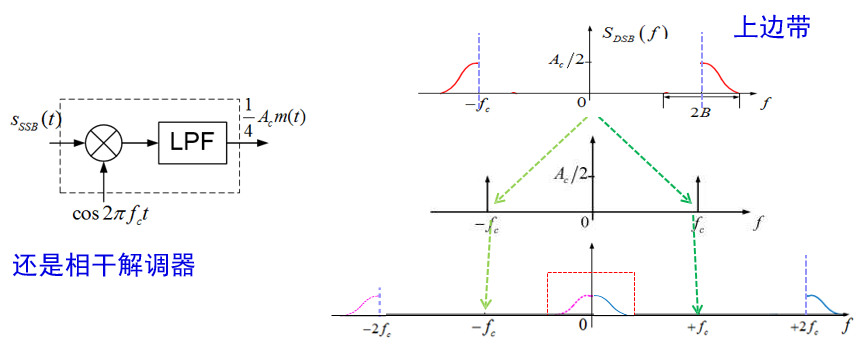

# 【现代通信原理】3 模拟调制系统

~30%

**重点**

- [ ] 调制的目的与意义
- [ ] 载波调制、脉冲调制
- [ ] 幅度调制4种：设计上的递进关系。
  - [ ] 着重常规调幅和 DSB。掌握原理框图每个点的原理波形、调制表达式、调幅指数、效率、解调同理、DSB 相干解调同步问题
- [ ] 角度调制、同理、频谱特点、带宽

---

[TOC]

## 调制的概念  

### 调制的目的  

- 将调制信号转换成**适合于信道传输**的已调信号
- 通过把多个基带信号分别搬移到不同的载频处，实现信道的**多路复用**，提高信道利用率
- **扩展信号带宽**，提高系统抗干扰、抗衰落能力
- 实现**传输带宽**与**信噪比**之间的互换

### 调制的定义  

调制就是把信号转换成适合在信道中传输形式的过程

- 广义调制分为**基带调制**和**载波调制**，载波调制是用调制信号（基带信号）控制载波的某个（或几个）参数的过程
- 狭义的调制就是指**载波调制**

### 调制的分类

根据*载波类型*、*调制信号*、*载波参数变化*的不同进行分类

- 连续波调制
  - 模拟连续波调制
    - 幅度调制
      - AM
      - DSB-SC
      - SSB
      - VSB
    - 角度调制
      - FM
      - PM
  - 数字连续波调制
- 脉冲调制
  - 模拟脉冲调制
  - 数字脉冲调制

### 调制模型  

 

 

## 幅度调制  

幅度调制——用消息去控制正弦载波的幅度变化

- 常规调幅（ Conv. AM ）*conventional*
- 抑制载波双边带调幅（ DSB-SC ）
- 单边带调幅（ SSB ）
- 残留边带调幅（ VSB ）  

### 常规调幅 (conventional AM)

$$
s_{A M}(t)=A_{c}[1+m(t)] \cos 2 \pi f_{c} t
$$

**频谱特点**

1) 频带信号: 位于载频 $f_{c}$, 
2) 带宽 $B_{T}=2 B$
3) 上、下两个边带:
上边带 (USB) 一高于 $f_{c}$ 的边带
下边带 (LSB) 一低于 $f_{c}$ 的边带
3) $\pm f_{c}$ 处有两个冲激, 有纯载波。

**波形特点**

消息突显在载波包络上

**调幅指数** 

$\beta_{AM}= \mathrm{max} {\left|m(t)\right| }$

**发送与接受**

**功率与效率**

峰值平均功率比（PAPR—Peak to Average Power Ratio）

$$
\mathrm{PRAP}_{m(t)} = \frac{\mathrm{max}   {\left| m(t) \right|}^2}{\overline{m^2(t)}}
$$

$$
\eta_{A M}=\frac{P_{m}}{P_{A M}}=\frac{P_{m}}{P_{m}+P_{c}}=\frac{\overline{m^{2}(t)}}{1+\overline{m^{2}(t)}}
$$

$$
\eta_{A M_{-} \text {临界}}=\frac{1}{1+P A P R_{m(t)}}
$$

正弦测试信号PAPR=2，$\eta_{A M}$ = 33%

**评价**

接收简单，廉价实用

 

### 抑制载波双边带调幅（ DSB-SC ）

解决：$\pm f_c$ 处有两个冲击

**频谱特点**

1) 频带信号: 位于载频 $f_{c}$, 
2) 带宽 $B_{T}=2 B$
3) 上、下两个边带:
   上边带 (USB) 一高于 $f_{c}$ 的边带
   下边带 (LSB) 一低于 $f_{c}$ 的边带
4) ~~$\pm f_{c}$ 处有两个冲激, 有纯载波。~~

**功率与调制效率**

$$
\begin{aligned}
P_{D S B} &=\overline{s_{D S B}^{2}(t)}=\overline{A_{c}^{2} m^{2}(t) \cos ^{2} 2 \pi f_{c} t} \\
&=P_{m}=A_{c}^{2} \overline{m^{2}(t)} / 2 \\
\eta_{D S B} &=1
\end{aligned}
$$

#### 发送与接收方法

*需要同步的原因是要移到中间*

LPF：低通滤波器

#### 同步问题

相干解调——需要与载波同步的本地振荡

非相干解调——不需要与载波同步的本地振荡，如，包络检波

**锁相环（Phase-Lock-Loop）**

**VCO**： 用一个可控振荡器产生本振

**比较**：与含有载波信息的信号进行比较，看差距多大

**反馈**：用误差改进振荡

**滤波**：“长期观察”，不要草率调节

$$
\begin{aligned}
L P F_{\mathrm{B}} &\left\{A_{c} m(t) \cos 2 \pi f_{c} t \times \cos \left(2 \pi f_{o} t+\theta_{o}\right)\right\} \\
&=L P F_{\mathrm{B}}\left\{\frac{1}{2} A_{c} m(t)\left\{\begin{array}{l}
\cos \left[2 \pi\left(f_{0}-f_{c}\right) t+\Delta \theta\right] \\
+\cos \left[2 \pi\left(f_{0}+f_{c}\right) t+\Delta \theta\right]
\end{array}\right\}\right\} \\
&=\frac{1}{2} A_{c} m(t) \cos \left[2 \pi\left(f_{0}-f_{c}\right) t+\Delta \theta\right]
\end{aligned}
$$

#### 评价

效率高，噪声性能好

需要复杂的PLL

 

### 单边带（ SSB ）

解决：对称的冗余

#### LSB、USB信号公式

$$
s_{S S B}(t)=\frac{1}{2} A_{c} m(t) \cos 2 \pi f_{c} t\mp \frac{1}{2} A_{c} \hat{m}(t) \sin 2 \pi f_{c} t
$$

$-$：上边带

$+$：下边带

$ \hat{m}(t)$：==希尔伯特变换==

> [希尔伯特变换（Hilbert变化） - 知乎 (zhihu.com)](https://zhuanlan.zhihu.com/p/422435352)
>
> 3、Hilbert变换的主要性质
>
> - Hilbert变换保持能量守恒
> - ![[公式]](https://www.zhihu.com/equation?tex=f%28t%29) 和 ![[公式]](https://www.zhihu.com/equation?tex=%5Ctilde%7Bf%7D%28t%29) 互为奇偶函数
> - ![[公式]](https://www.zhihu.com/equation?tex=f%28t%29) 和 ![[公式]](https://www.zhihu.com/equation?tex=%5Ctilde%7Bf%7D%28t%29)正交
>
> 4、常用的Hilbert变换对
>
> 

#### 接收方法

相干解调器

如加入足够的载波，也可用包络检波器

#### SSB的相移生成方法

**评价**

带宽=B

### 残留边带（ VSB ）调幅  

“残留”一点， 只要过渡带形状 满足对称互补

## 角度调制  

瞬时相位，对应于载波的瞬时相位偏移，角频率，瞬时频偏$\frac{d}{dt}(\phi(t))$

### FM 与 PM

频率和相位之间存在积分关系，可以相互转换

- 间接调相：调制信号->微分->调频->得调相波
- 间接调频：调制信号->积分->调相->得调频波

FM, 积分器->PM调制器

PM，微分器->FM调制器

PM可能间断，带宽宽；
FM必定连续，带宽高效

同一个已调信号可以是FM与PM信号， 看起来令人困惑。
FM与PM波形是相对的、关联的。

FM或PM是恒幅波
不怕非线性失真！大功率放大器的常 见问题。

### 角度调制的基本参数

#### 调制的程度

最大频偏/相偏

- 正比于调制系数 $k_{FM}$ 与 $k_{PM}$

- 正比于消息信号的（最大）幅度

#### 正弦消息特例与==调制指数==  

时域表达式，调相指数表示最大频偏，调频指数表示最大相偏

### 角度调制的带宽与频谱特点  

#### 带宽 Carson 公式

$$
D=\frac{\Delta f_{max}}{B}
$$

$$
B_T = 2 \Delta f_{max} + 2B = 2(D+1)B
$$

卡森公式， 广泛用于计算调频信号带宽，可用于单一频率和非单一频率的调频，这里**调制指数**代表最大频偏与最高调制频率F的比值，其等于最大角频偏与最大角频率的比值。

调频信号频谱包含无限频率分量，实际上边频得幅度随着n的增大可以忽略不计，可认为具有有限频谱，B=fm，D=K_FM

普通单声道调频广播中，调制信号的最大频偏为75KHZ，最高调制频率F为15KHZ，故调频指数 =5，由公式可计算出此FM信号的频带宽度为180KHZ

#### 频谱特点

考虑正弦消息信号的FM情况:
$$
m(t)=a \cos \left(2 \pi f_{m} t\right) \\
s(t)=A_{c} \cos \left[2 \pi f_{c} t+\beta \sin \left(2 \pi f_{m} t\right)\right]
$$
1) $\beta<<1$ : **窄带角调制**; $\beta$ 变大时为**宽带角调制**;
2) $B_{T}$ 是以 Carson 公式估算, 准确地反映了信号的 带宽，对应部分包括约 99%的功率;
3) $m(t)$ 为正弦周期函数, 产生的调制信号是周期的。 频谱形状为基频的**大量谱线**构成, **细节变化大**。

在功率上调频信号平均功率等于未调载波平均功率，只是将原载波中部分功率分配给每个边频分量，分配原则与调频指数相关

#### 评价

高品质源于宽频带

- 宽带调频应用广泛
- 窄带调频应用较少

相对的，AM广播采用一般语音消息，调制后 2x4=8（kHz）。 电台频带工作在1MHz上下（中波），只需10kHz。干扰易引起幅度变化，抗干扰能力差，音质不佳。
高品质的FM广播工作在100MHz上下（超短波），频带需200kHz。横幅特性利于抗干扰，音质好，传播距离较近。

# 作业

**已知调制信号$m(t)=cos(2000 \pi t)$，载波为$2cos10^4\pi t$，分别写出AM、DSB、USB、LSB信号的时域表示式，并画出频谱图。**

- AM

- DSB

- USB

- LSB

---

**已知某单频调频波的振幅是10V，瞬时频率为$f(t)=10^6+10^4cos2 \pi 10^3 t \mathrm{(Hz)}$，**

**（1）此调频波的表达式; **

**（2）此调频波的最大频率偏移、调频指数和频带宽度**

最大频率偏移

调频指数

频带宽度