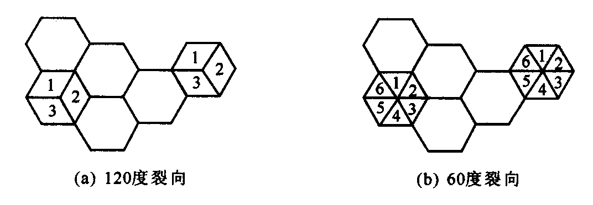

# 【现代通信原理】8 蜂窝系统

**重点**

- [ ] 蜂窝、区群的概念；蜂窝系统的组网方式、大区制小区制中心
- [ ] 同道、邻道干扰
- [ ] 形状、为什么选择六边形
- [ ] 复用；同频干扰；区群；小区分裂
- [ ] 区群：扩大系统容量；相互邻接的概念；频率复用因子。乘积关系，系统容量扩大
- [ ] 小区数条件的公式 ... = j^2..
- [ ] 区群的复制；系统容量的确定。考察大题：系统容量c，确定系统容量；基于区群尺寸n，计算总信道数。
- [ ] 区群尺寸与系统容量的关系，基于同频干扰
- [ ] 小区规划。确定最近的同..小区，利用i^2....顺时针...
- [ ] 小区改善的三种方法：扇区划分...

## 8.1 概述

移动通信组网的概念
若干个用户如何有效地构成一个系统，使得 系统内的用户可以在无线电波的覆盖区域内的任 何地方相互通信。

组网方法

- 大区制：集群系统；
- 小区制：蜂窝系统（GSM、IS-95）；  无中心移动通信系统：如Ad hoc网络。

### 大区制

### 大区制的覆盖范围问题

#### （1）静区

#### （2）上下行功率不平衡 问题的提出

### 大区制中的干扰问题

•互调干扰

•邻频干扰

•同频干扰

•其他的外界干扰和噪声

其中同频干扰，邻频干扰和互调干扰的影响最大，且无法根除。

#### 互调干扰

#### 邻道干扰

## 8.2 蜂窝

### 蜂窝的概念

### 小区的形状

### 切换（过区切换、越区切换）

## 8.3 区群

### 1.通过频率复用扩大系统容量

### 2.频率复用下的小区规划

### 3.六边形小区的几何结构

### 4.频率复用比

## 8.4 同信道与相邻信道干扰

### 8.4.1 同信道干扰

### 8.4.2 邻信道干扰

### 8.4.3 蜂窝小区容量的改善

#### 小区分裂

#### 扇区划分

蜂窝系统中的同频干扰可以通过使用定向天线代替基站中单独的一根全向天线来减小，其中每个定向天线辐射某一特定的扇区。由于使用了定向天线，小区将只接收同频小区中一部分小区的干扰。这种使用定向天线来减小同频干扰，从而提高系统容量的技术叫做裂向。

采用裂向技术以后，在某个小区中使用的信道就分为分散的组，
每组只在某个扇区中使用

扇区划分（裂向）减少同频干扰  

扇区划分提高系统容量

#### 新微小区

